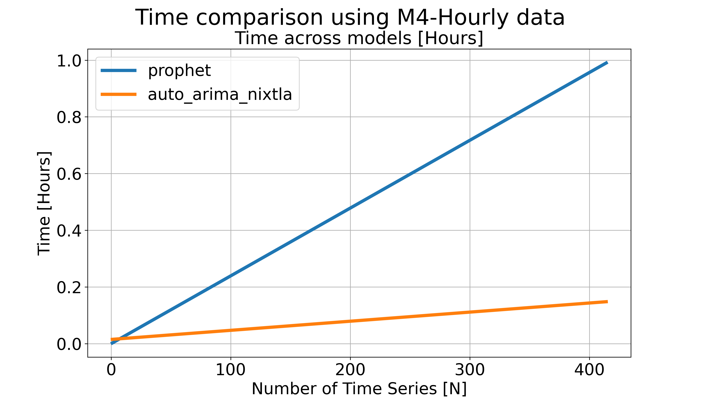
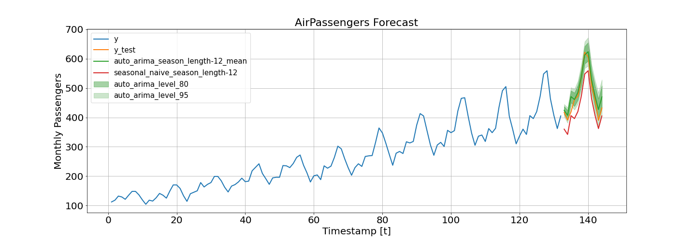

# Nixtla &nbsp; [](https://twitter.com/intent/tweet?text=Statistical%20Forecasting%20Algorithms%20by%20Nixtla%20&url=https://github.com/Nixtla/statsforecast&via=nixtlainc&hashtags=StatisticalModels,TimeSeries,Forecasting) &nbsp;[](https://join.slack.com/t/nixtlaworkspace/shared_invite/zt-135dssye9-fWTzMpv2WBthq8NK0Yvu6A)
<!-- ALL-CONTRIBUTORS-BADGE:START - Do not remove or modify this section -->
[](#contributors-)
<!-- ALL-CONTRIBUTORS-BADGE:END -->

<div align="center">

<h1 align="center">Statistical ⚡️ Forecast</h1>
<h3 align="center">Lightning fast forecasting with statistical and econometric models</h3>
    
[](https://github.com/Nixtla/statsforecast/actions/workflows/ci.yaml)
[](https://pypi.org/project/statsforecast/)
[](https://pypi.org/project/statsforecast/)
[](https://anaconda.org/conda-forge/statsforecast)
[](https://github.com/Nixtla/statsforecast/blob/main/LICENSE)
[](https://nixtla.github.io/statsforecast/)  
    
**StatsForecast** offers a collection of widely used univariate time series forecasting models, including exponential smoothing and automatic `ARIMA` modeling optimized for high performance using `numba`.
</div>

## 🔥  Highlights

* Fastest and most accurate `auto_arima` in `Python` and `R`.
* **New!**: Replace FB-Prophet in two lines of code and gain speed and accuracy. Check the experiments [here](https://github.com/Nixtla/statsforecast/tree/main/experiments/arima_prophet_adapter).
* **New!**: Distributed compuration in clusters with [ray](https://github.com/ray-project/ray). (Forecast 1M series in [30min](https://github.com/Nixtla/statsforecast/tree/main/experiments/ray))
* **New!**: Good Ol' sklearn syntax with `AutoARIMA().fit(y).predict(h=7)`.

## 🎊 Features 

* Inclusion of `exogenous variables` and `prediction intervals`.
* Out of the box implementation of `exponential smoothing`, `croston`, `sesonal naive`, `random walk with drift` and `tbs`.
* 20x faster than `pmdarima`.
* 1.5x faster than `R`.
* 500x faster than `Prophet`. 
* Compiled to high performance machine code through [`numba`](https://numba.pydata.org/).
* 1,000,000 series in [30 min](https://github.com/Nixtla/statsforecast/tree/main/experiments/ray) with [ray](https://github.com/ray-project/ray).

Missing something? Please open an issue or write us in [](https://join.slack.com/t/nixtlaworkspace/shared_invite/zt-135dssye9-fWTzMpv2WBthq8NK0Yvu6A)

## 📖 Why? 

Current Python alternatives for statistical models are slow and inaccurate. So we created a library that can be used to forecast in production environments or as benchmarks.  `StatsForecast` includes an extensive battery of models that can efficiently fit thousands of time series.

### 🔬 Accuracy

We compared accuracy and speed against: [pmdarima](https://github.com/alkaline-ml/pmdarima), Rob Hyndman's [forecast](https://github.com/robjhyndman/forecast) package and Facebook's [Prophet](https://github.com/facebook/prophet). We used the `Daily`, `Hourly` and `Weekly` data from the [M4 competition](https://www.sciencedirect.com/science/article/pii/S0169207019301128). 

The following table summarizes the results. As can be seen, our `auto_arima` is the best model in accuracy (measured by the `MASE` loss) and time, even compared with the original implementation in R.

| dataset   | metric   |   nixtla | pmdarima [1] |   auto_arima_r |   prophet |
|:----------|:---------|--------------------:|----------------------:|---------------:|----------:|
| M4-Daily     | MASE     |                **3.26** |                  3.35 |           4.46 |     14.26 |
| M4-Daily     | time     |                **1.41** |                 27.61 |           1.81 |    514.33 |
| M4-Hourly    | MASE     |                **0.92** |                ---    |           1.02 |      1.78 |
| M4-Hourly    | time     |               **12.92** |                ---    |          23.95 |     17.27 |
| M4-Weekly    | MASE     |                **2.34** |                  2.47 |           2.58 |      7.29 |
| M4-Weekly    | time     |                0.42 |                  2.92 |           **0.22** |     19.82 |


[1] The model `auto_arima` from `pmdarima` had problems with Hourly data. An issue was opened in their repo.

The following table summarizes the data details.
 
| group   | n_series   | mean_length   | std_length   |   min_length | max_length   |
|:--------|-----------:|--------------:|-------------:|-------------:|-------------:|
| Daily   | 4,227      | 2,371         | 1,756        |          107 | 9,933        |
| Hourly  | 414        | 901           | 127          |          748 | 1,008        |
| Weekly  | 359        | 1,035         | 707          |           93 | 2,610        | 

### ⏲ Computational efficiency

We measured the computational time against the number of time series. The following graph shows the results. As we can see, the fastest model is our `auto_arima`.


<details>
    <summary> Nixtla vs Prophet </summary> 
     
</details>

You can reproduce the results [here](/experiments/arima/).

### External regressors

Results with external regressors are qualitatively similar to the reported before. You can find the complete experiments [here](/experiments/arima_xreg/).

## 👾 Less code


## 📖 Documentation
Here is a link to the [documentation](https://nixtla.github.io/statsforecast/).

## 🧬 Getting Started [](https://colab.research.google.com/github/nixtla/statsforecast/blob/main/examples/arima.ipynb)

[Example Jupyter Notebook](https://github.com/Nixtla/statsforecast/blob/main/examples/arima.ipynb)

## 💻 Installation
<details>
<summary>PyPI</summary>

You can install the *released version* of `StatsForecast` from the [Python package index](https://pypi.org) with:

```python
pip install statsforecast
```

(Installing inside a python virtualenvironment or a conda environment is recommended.)
</details>

<details>
<summary>Conda</summary>
  
Also you can install the *released version* of `StatsForecast` from [conda](https://anaconda.org) with:

```python
conda install -c conda-forge statsforecast
```

(Installing inside a python virtualenvironment or a conda environment is recommended.)
</details>

<details>
<summary>Dev Mode</summary>
If you want to make some modifications to the code and see the effects in real time (without reinstalling), follow the steps below:

```bash
git clone https://github.com/Nixtla/statsforecast.git
cd statsforecast
pip install -e .
```
</details>

## 🧬 How to use

The following example needs `ipython` and `matplotlib` as additional packages. If not installed, install it via your preferred method, e.g. `pip install ipython matplotlib`.

```python
import numpy as np
import pandas as pd
from IPython.display import display, Markdown

import matplotlib.pyplot as plt
from statsforecast import StatsForecast
from statsforecast.models import seasonal_naive, auto_arima
from statsforecast.utils import AirPassengers
```

```python
horizon = 12
ap_train = AirPassengers[:-horizon]
ap_test = AirPassengers[-horizon:]
```

```python
series_train = pd.DataFrame(
    {
        'ds': pd.date_range(start='1949-01-01', periods=ap_train.size, freq='M'),
        'y': ap_train
    },
    index=pd.Index([0] * ap_train.size, name='unique_id')
)
```
```python
fcst = StatsForecast(
    series_train, 
    models=[(auto_arima, 12), (seasonal_naive, 12)], 
    freq='M', 
    n_jobs=1
)
forecasts = fcst.forecast(12, level=(80, 95))
```

```python
forecasts['y_test'] = ap_test
```

```python
fig, ax = plt.subplots(1, 1, figsize = (20, 7))
df_plot = pd.concat([series_train, forecasts]).set_index('ds')
df_plot[['y', 'y_test', 'auto_arima_season_length-12_mean', 'seasonal_naive_season_length-12']].plot(ax=ax, linewidth=2)
ax.fill_between(df_plot.index, 
                df_plot['auto_arima_season_length-12_lo-80'], 
                df_plot['auto_arima_season_length-12_hi-80'],
                alpha=.35,
                color='green',
                label='auto_arima_level_80')
ax.fill_between(df_plot.index, 
                df_plot['auto_arima_season_length-12_lo-95'], 
                df_plot['auto_arima_season_length-12_hi-95'],
                alpha=.2,
                color='green',
                label='auto_arima_level_95')
ax.set_title('AirPassengers Forecast', fontsize=22)
ax.set_ylabel('Monthly Passengers', fontsize=20)
ax.set_xlabel('Timestamp [t]', fontsize=20)
ax.legend(prop={'size': 15})
ax.grid()
for label in (ax.get_xticklabels() + ax.get_yticklabels()):
    label.set_fontsize(20)
```


    

    


### Adding external regressors

```python
series_train['trend'] = np.arange(1, ap_train.size + 1)
series_train['intercept'] = np.ones(ap_train.size)
series_train['month'] = series_train['ds'].dt.month
series_train = pd.get_dummies(series_train, columns=['month'], drop_first=True)
```

```python
display_df(series_train.head())
```


|   unique_id | ds                  |   y |   trend |   intercept |   month_2 |   month_3 |   month_4 |   month_5 |   month_6 |   month_7 |   month_8 |   month_9 |   month_10 |   month_11 |   month_12 |
|------------:|:--------------------|----:|--------:|------------:|----------:|----------:|----------:|----------:|----------:|----------:|----------:|----------:|-----------:|-----------:|-----------:|
|           0 | 1949-01-31 00:00:00 | 112 |       1 |           1 |         0 |         0 |         0 |         0 |         0 |         0 |         0 |         0 |          0 |          0 |          0 |
|           0 | 1949-02-28 00:00:00 | 118 |       2 |           1 |         1 |         0 |         0 |         0 |         0 |         0 |         0 |         0 |          0 |          0 |          0 |
|           0 | 1949-03-31 00:00:00 | 132 |       3 |           1 |         0 |         1 |         0 |         0 |         0 |         0 |         0 |         0 |          0 |          0 |          0 |
|           0 | 1949-04-30 00:00:00 | 129 |       4 |           1 |         0 |         0 |         1 |         0 |         0 |         0 |         0 |         0 |          0 |          0 |          0 |
|           0 | 1949-05-31 00:00:00 | 121 |       5 |           1 |         0 |         0 |         0 |         1 |         0 |         0 |         0 |         0 |          0 |          0 |          0 |


```python
xreg_test = pd.DataFrame(
    {
        'ds': pd.date_range(start='1960-01-01', periods=ap_test.size, freq='M')
    },
    index=pd.Index([0] * ap_test.size, name='unique_id')
)
```

```python
xreg_test['trend'] = np.arange(133, ap_test.size + 133)
xreg_test['intercept'] = np.ones(ap_test.size)
xreg_test['month'] = xreg_test['ds'].dt.month
xreg_test = pd.get_dummies(xreg_test, columns=['month'], drop_first=True)
```

```python
fcst = StatsForecast(
    series_train, 
    models=[(auto_arima, 12), (seasonal_naive, 12)], 
    freq='M', 
    n_jobs=1
)
forecasts = fcst.forecast(12, xreg=xreg_test, level=(80, 95))
```

```python
forecasts['y_test'] = ap_test
```

## 🔨 How to contribute
See [CONTRIBUTING.md](https://github.com/Nixtla/statsforecast/blob/main/CONTRIBUTING.md).

## 📃 References
*  The `auto_arima` model is based (translated) from the R implementation included in the [forecast](https://github.com/robjhyndman/forecast) package developed by Rob Hyndman.

## Contributors ✨

Thanks goes to these wonderful people ([emoji key](https://allcontributors.org/docs/en/emoji-key)):

<!-- ALL-CONTRIBUTORS-LIST:START - Do not remove or modify this section -->
<!-- prettier-ignore-start -->
<!-- markdownlint-disable -->
<table>
  <tr>
    <td align="center"><a href="https://github.com/FedericoGarza"><br /><sub><b>fede</b></sub></a><br /><a href="https://github.com/Nixtla/statsforecast/commits?author=FedericoGarza" title="Code">💻</a></td>
    <td align="center"><a href="https://github.com/jmoralez"><br /><sub><b>José Morales</b></sub></a><br /><a href="https://github.com/Nixtla/statsforecast/commits?author=jmoralez" title="Code">💻</a> <a href="#maintenance-jmoralez" title="Maintenance">🚧</a></td>
    <td align="center"><a href="https://www.linkedin.com/in/sugatoray/"><br /><sub><b>Sugato Ray</b></sub></a><br /><a href="https://github.com/Nixtla/statsforecast/commits?author=sugatoray" title="Code">💻</a></td>
    <td align="center"><a href="http://www.jefftackes.com"><br /><sub><b>Jeff Tackes</b></sub></a><br /><a href="https://github.com/Nixtla/statsforecast/issues?q=author%3Atackes" title="Bug reports">🐛</a></td>
    <td align="center"><a href="https://github.com/darinkist"><br /><sub><b>darinkist</b></sub></a><br /><a href="#ideas-darinkist" title="Ideas, Planning, & Feedback">🤔</a></td>
    <td align="center"><a href="https://github.com/alech97"><br /><sub><b>Alec Helyar</b></sub></a><br /><a href="#question-alech97" title="Answering Questions">💬</a></td>
    <td align="center"><a href="https://dhirschfeld.github.io"><br /><sub><b>Dave Hirschfeld</b></sub></a><br /><a href="#question-dhirschfeld" title="Answering Questions">💬</a></td>
  </tr>
  <tr>
    <td align="center"><a href="https://github.com/mergenthaler"><br /><sub><b>mergenthaler</b></sub></a><br /><a href="https://github.com/Nixtla/statsforecast/commits?author=mergenthaler" title="Code">💻</a></td>
    <td align="center"><a href="https://github.com/kdgutier"><br /><sub><b>Kin</b></sub></a><br /><a href="https://github.com/Nixtla/statsforecast/commits?author=kdgutier" title="Code">💻</a></td>
    <td align="center"><a href="https://github.com/Yasslight90"><br /><sub><b>Yasslight90</b></sub></a><br /><a href="#ideas-Yasslight90" title="Ideas, Planning, & Feedback">🤔</a></td>
    <td align="center"><a href="https://github.com/asinig"><br /><sub><b>asinig</b></sub></a><br /><a href="#ideas-asinig" title="Ideas, Planning, & Feedback">🤔</a></td>
    <td align="center"><a href="https://github.com/guerda"><br /><sub><b>Philip Gillißen</b></sub></a><br /><a href="https://github.com/Nixtla/statsforecast/commits?author=guerda" title="Code">💻</a></td>
  </tr>
</table>

<!-- markdownlint-restore -->
<!-- prettier-ignore-end -->

<!-- ALL-CONTRIBUTORS-LIST:END -->

This project follows the [all-contributors](https://github.com/all-contributors/all-contributors) specification. Contributions of any kind welcome!
