```python
# This cell will not be rendered but is to hide warnings and limit the rows shown

import warnings
warnings.filterwarnings("ignore")

import logging
logging.getLogger('statsforecast').setLevel(logging.ERROR)

import pandas as pd
pd.set_option('display.max_rows', 6)
```


> Step-by-step guide on using the `MSTL Model` with `Statsforecast`.

During this walkthrough, we will become familiar with the main
`StatsForecast` class and some relevant methods such as
`StatsForecast.plot`, `StatsForecast.forecast` and
`StatsForecast.cross_validation` in other.

The text in this article is largely taken from: 1. [Changquan Huang •
Alla Petukhina. Springer series (2022). Applied Time Series Analysis and
Forecasting with
Python.](https://link.springer.com/book/10.1007/978-3-031-13584-2) 2.
Ivan Svetunkov. [Forecasting and Analytics with the Augmented Dynamic
Adaptive Model (ADAM)](https://openforecast.org/adam/) 3. [James D.
Hamilton. Time Series Analysis Princeton University Press, Princeton,
New Jersey, 1st Edition,
1994.](https://press.princeton.edu/books/hardcover/9780691042893/time-series-analysis)
4. [Rob J. Hyndman and George Athanasopoulos (2018). “Forecasting
Principles and Practice (3rd ed)”](https://otexts.com/fpp3/tscv.html).

## Table of Contents

-   [Introduction](#introduction)
-   [IMAPA Model](#model)
-   [Loading libraries and data](#loading)
-   [Explore data with the plot method](#plotting)
-   [Split the data into training and testing](#splitting)
-   [Implementation of IMAPA with StatsForecast](#implementation)
-   [Cross-validation](#cross_validate)
-   [Model evaluation](#evaluate)
-   [References](#references)

## Introduction <a class="anchor" id="introduction"></a>

The MSTL model (Multiple Seasonal-Trend decomposition using LOESS) is a
method used to decompose a time series into its seasonal, trend and
residual components. This approach is based on the use of LOESS (Local
Regression Smoothing) to estimate the components of the time series.

The MSTL decomposition is an extension of the classic seasonal-trend
decomposition method (also known as Holt-Winters decomposition), which
is designed to handle situations where multiple seasonal patterns exist
in the data. This can occur, for example, when a time series exhibits
daily, weekly, and yearly patterns simultaneously.

The MSTL decomposition process is performed in several stages:

1.  Trend estimation: LOESS is used to estimate the trend component of
    the time series. LOESS is a non-parametric smoothing method that
    locally fits data and allows complex trend patterns to be captured.

2.  Estimation of seasonal components: Seasonal decomposition techniques
    are applied to identify and model the different seasonal patterns
    present in the data. This involves extracting and modeling seasonal
    components, such as daily, weekly, or yearly patterns.

3.  Estimation of the residuals: The residuals are calculated as the
    difference between the original time series and the sum of the
    estimates of trend and seasonal components. Residuals represent
    variation not explained by trend and seasonal patterns and may
    contain additional information or noise.

MSTL decomposition allows you to analyze and understand the different
components of a time series in more detail, which can make it easier to
forecast and detect patterns or anomalies. Furthermore, the use of LOESS
provides flexibility to adapt to different trend and seasonal patterns
present in the data.

It is important to note that the MSTL model is only one of the available
approaches for time series decomposition and that its choice will depend
on the specific characteristics of the data and the application context.

## MSTL <a class="anchor" id="model"></a>

An important objective in time series analysis is the decomposition of a
series into a set of non-observable (latent) components that can be
associated with different types of temporal variations. The idea of time
series decomposition is very old and was used for the calculation of
planetary orbits by seventeenth century astronomers. Persons was the
first to state explicitly the assumptions of unobserved components. As
Persons saw it, time series was composed of four types of fluctuations:

1.  a long-term tendency or secular trend;
2.  cyclical movements superimposed upon the long-term trend. These
    cycles appear to reach their peaks during periods of industrial
    prosperity and their troughs during periods of depressions, their
    rise and fall constituting the business cycle;
3.  a seasonal movement within each year, the shape of which depends on
    the nature of the series;
4.  residual variations due to changes impacting individual variables or
    other major events, such as wars and national catastrophes affecting
    a number of variables.

Traditionally, the four variations have been assumed to be mutually
independent from one another and specified by means of an additive
decomposition model:

$$
\begin{equation}
y_t= T_t +C_t +S_t +I_t, t=1,\ \cdots, n  \tag 1
\end{equation}
$$

where $y_t$ denotes the observed series at time $t$, $T_t$ the long-term
trend, $C_t$ the business cycle, $S_t$ seasonality, and $I_t$ the
irregulars.

If there is dependence among the latent components, this relationship is
specified through a multiplicative model

$$
\begin{equation}
y_t= T_t \times C_t \times S_t \times I_t, t=1,\ \cdots, n  \tag 2
\end{equation}
$$

where now $S_t$ and $I_t$ are expressed in proportion to the trend-cycle
$T_t \times C_t$ . In some cases, mixed additive-multiplicative models
are used.

### LOESS (Local Regression Smoothing)

LOESS is a nonparametric smoothing method used to estimate a smooth
function that locally fits the data. For each point in the time series,
LOESS performs a weighted regression using nearest neighbors.

The LOESS calculation involves the following steps:

-   For each point t in the time series, a nearest neighbor window is
    selected.
-   Weights are assigned to neighbors based on their proximity to t,
    using a weighting function, such as the Gaussian kernel.
-   A weighted regression is performed using the neighbors and their
    assigned weights.
-   The fitted value for point t is obtained based on local regression.
-   The process is repeated for all points in the time series, thus
    obtaining a smoothed estimate of the trend.

### MSTL General Properties

The MSTL model (Multiple Seasonal-Trend decomposition using LOESS) has
several properties that make it useful in time series analysis. Here is
a list of some of its properties:

1.  Decomposition of multiple seasonal components: The MSTL model is
    capable of handling time series that exhibit multiple seasonal
    patterns simultaneously. You can effectively identify and model
    different seasonal components present in the data.

2.  Flexibility in detecting complex trends: Thanks to the use of LOESS,
    the MSTL model can capture complex trend patterns in the data. This
    includes non-linear trends and abrupt changes in the time series.

3.  Adaptability to different seasonal frequencies: The MSTL model is
    capable of handling data with different seasonal frequencies, such
    as daily, weekly, monthly, or even yearly patterns. You can identify
    and model seasonal patterns of different cycle lengths. (see)
    [Seasonal
    periods](https://robjhyndman.com/hyndsight/seasonal-periods/)

| Frecuencia |
|------------|

| Data        | Minute | Hour | Day   | Week   | Year     |
|-------------|--------|------|-------|--------|----------|
| Daily       |        |      |       | 7      | 365.25   |
| Hourly      |        |      | 24    | 168    | 8766     |
| Half-hourly |        |      | 48    | 336    | 17532    |
| Minutes     |        | 60   | 1440  | 10080  | 525960   |
| Seconds     | 60     | 3600 | 86400 | 604800 | 31557600 |

1.  Ability to smooth noise and outliers: The smoothing process used in
    LOESS allows to reduce the impact of noise and outliers in the time
    series. This can improve detection of underlying patterns and make
    it easier to analyze trend and seasonality.

2.  Improved forecasting: By decomposing the time series into seasonal,
    trend, and residual components, the MSTL model can provide more
    accurate forecasts. Forecasts can be generated by extrapolating
    trend and seasonal patterns into the future, and adding the
    stochastic residuals.

3.  More detailed interpretation and analysis: The MSTL decomposition
    allows you to analyze and understand the different components of the
    time series in a more detailed way. This facilitates the
    identification of seasonal patterns, changes in trend, and the
    evaluation of residual variability.

4.  Efficient Implementation: Although the specific implementation may
    vary, the MSTL model can be calculated efficiently, especially when
    LOESS is used in combination with optimized calculation algorithms.

These properties make the MSTL model a useful tool for exploratory time
series analysis, data forecasting, and pattern detection in the presence
of multiple seasonal components and complex trends.

## Loading libraries and data <a class="anchor" id="loading"></a>

> **Tip**
>
> Statsforecast will be needed. To install, see
> [instructions](../getting-started/0_Installation.ipynb).

Next, we import plotting libraries and configure the plotting style.

```python
import matplotlib.pyplot as plt
import seaborn as sns
from statsmodels.graphics.tsaplots import plot_acf, plot_pacf
plt.style.use('grayscale') # fivethirtyeight  grayscale  classic
plt.rcParams['lines.linewidth'] = 1.5
dark_style = {
    'figure.facecolor': '#008080',  # #212946
    'axes.facecolor': '#008080',
    'savefig.facecolor': '#008080',
    'axes.grid': True,
    'axes.grid.which': 'both',
    'axes.spines.left': False,
    'axes.spines.right': False,
    'axes.spines.top': False,
    'axes.spines.bottom': False,
    'grid.color': '#000000',  #2A3459
    'grid.linewidth': '1',
    'text.color': '0.9',
    'axes.labelcolor': '0.9',
    'xtick.color': '0.9',
    'ytick.color': '0.9',
    'font.size': 12 }
plt.rcParams.update(dark_style)


from pylab import rcParams
rcParams['figure.figsize'] = (18,7)
```


```python
import pandas as pd
df=pd.read_csv("https://raw.githubusercontent.com/Naren8520/Serie-de-tiempo-con-Machine-Learning/main/Data/ads.csv")

df.head()
```

|     | Time                | Ads    |
|-----|---------------------|--------|
| 0   | 2017-09-13T00:00:00 | 80115  |
| 1   | 2017-09-13T01:00:00 | 79885  |
| 2   | 2017-09-13T02:00:00 | 89325  |
| 3   | 2017-09-13T03:00:00 | 101930 |
| 4   | 2017-09-13T04:00:00 | 121630 |

The input to StatsForecast is always a data frame in long format with
three columns: unique_id, ds and y:

-   The `unique_id` (string, int or category) represents an identifier
    for the series.

-   The `ds` (datestamp) column should be of a format expected by
    Pandas, ideally YYYY-MM-DD for a date or YYYY-MM-DD HH:MM:SS for a
    timestamp.

-   The `y` (numeric) represents the measurement we wish to forecast.

```python
df["unique_id"]="1"
df.columns=["ds", "y", "unique_id"]
df.head()
```

|     | ds                  | y      | unique_id |
|-----|---------------------|--------|-----------|
| 0   | 2017-09-13T00:00:00 | 80115  | 1         |
| 1   | 2017-09-13T01:00:00 | 79885  | 1         |
| 2   | 2017-09-13T02:00:00 | 89325  | 1         |
| 3   | 2017-09-13T03:00:00 | 101930 | 1         |
| 4   | 2017-09-13T04:00:00 | 121630 | 1         |

```python
print(df.dtypes)
```

``` text
ds           object
y             int64
unique_id    object
dtype: object
```

We can see that our time variable `(ds)` is in an object format, we need
to convert to a date format

```python
df["ds"] = pd.to_datetime(df["ds"])
```

## Explore Data with the plot method <a class="anchor" id="plotting"></a>

Plot some series using the plot method from the StatsForecast class.
This method prints a random series from the dataset and is useful for
basic EDA.

```python
from statsforecast import StatsForecast

StatsForecast.plot(df)
```

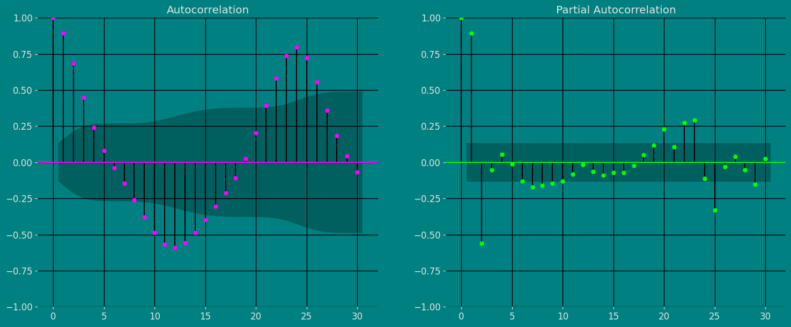

### Autocorrelation plots

Autocorrelation (ACF) and partial autocorrelation (PACF) plots are
statistical tools used to analyze time series. ACF charts show the
correlation between the values of a time series and their lagged values,
while PACF charts show the correlation between the values of a time
series and their lagged values, after the effect of previous lagged
values has been removed.

ACF and PACF charts can be used to identify the structure of a time
series, which can be helpful in choosing a suitable model for the time
series. For example, if the ACF chart shows a repeating peak and valley
pattern, this indicates that the time series is stationary, meaning that
it has the same statistical properties over time. If the PACF chart
shows a pattern of rapidly decreasing spikes, this indicates that the
time series is invertible, meaning it can be reversed to get a
stationary time series.

The importance of the ACF and PACF charts is that they can help analysts
better understand the structure of a time series. This understanding can
be helpful in choosing a suitable model for the time series, which can
improve the ability to predict future values of the time series.

To analyze ACF and PACF charts:

-   Look for patterns in charts. Common patterns include repeating peaks
    and valleys, sawtooth patterns, and plateau patterns.
-   Compare ACF and PACF charts. The PACF chart generally has fewer
    spikes than the ACF chart.
-   Consider the length of the time series. ACF and PACF charts for
    longer time series will have more spikes.
-   Use a confidence interval. The ACF and PACF plots also show
    confidence intervals for the autocorrelation values. If an
    autocorrelation value is outside the confidence interval, it is
    likely to be significant.

```python
fig, axs = plt.subplots(nrows=1, ncols=2)

plot_acf(df["y"],  lags=30, ax=axs[0],color="fuchsia")
axs[0].set_title("Autocorrelation");

# Grafico
plot_pacf(df["y"],  lags=30, ax=axs[1],color="lime")
axs[1].set_title('Partial Autocorrelation')

plt.show();
```


### Decomposition of the time series

How to decompose a time series and why?

In time series analysis to forecast new values, it is very important to
know past data. More formally, we can say that it is very important to
know the patterns that values follow over time. There can be many
reasons that cause our forecast values to fall in the wrong direction.
Basically, a time series consists of four components. The variation of
those components causes the change in the pattern of the time series.
These components are:

-   **Level:** This is the primary value that averages over time.
-   **Trend:** The trend is the value that causes increasing or
    decreasing patterns in a time series.
-   **Seasonality:** This is a cyclical event that occurs in a time
    series for a short time and causes short-term increasing or
    decreasing patterns in a time series.
-   **Residual/Noise:** These are the random variations in the time
    series.

Combining these components over time leads to the formation of a time
series. Most time series consist of level and noise/residual and trend
or seasonality are optional values.

If seasonality and trend are part of the time series, then there will be
effects on the forecast value. As the pattern of the forecasted time
series may be different from the previous time series.

The combination of the components in time series can be of two types: \*
Additive \* Multiplicative

### Additive time series

If the components of the time series are added to make the time series.
Then the time series is called the additive time series. By
visualization, we can say that the time series is additive if the
increasing or decreasing pattern of the time series is similar
throughout the series. The mathematical function of any additive time
series can be represented by:
$$y(t) = level + Trend + seasonality + noise$$

### Multiplicative time series

If the components of the time series are multiplicative together, then
the time series is called a multiplicative time series. For
visualization, if the time series is having exponential growth or
decline with time, then the time series can be considered as the
multiplicative time series. The mathematical function of the
multiplicative time series can be represented as.

$$y(t) = Level * Trend * seasonality * Noise$$

```python
from statsmodels.tsa.seasonal import seasonal_decompose
from plotly.subplots import make_subplots
import plotly.graph_objects as go

def plotSeasonalDecompose(
    x,
    model='additive',
    filt=None,
    period=None,
    two_sided=True,
    extrapolate_trend=0,
    title="Seasonal Decomposition"):

    result = seasonal_decompose(
            x, model=model, filt=filt, period=period,
            two_sided=two_sided, extrapolate_trend=extrapolate_trend)
    fig = make_subplots(
            rows=4, cols=1,
            subplot_titles=["Observed", "Trend", "Seasonal", "Residuals"])
    for idx, col in enumerate(['observed', 'trend', 'seasonal', 'resid']):
        fig.add_trace(
            go.Scatter(x=result.observed.index, y=getattr(result, col), mode='lines'),
                row=idx+1, col=1,
            )
    return fig
```


```python
plotSeasonalDecompose(
    df["y"],
    model="additive",
    period=24,
    title="Seasonal Decomposition")
```

``` text
Unable to display output for mime type(s): application/vnd.plotly.v1+json
```

## Split the data into training and testing<a class="anchor" id="splitting"></a>

Let’s divide our data into sets 1. Data to train our `MSTL Model`. 2.
Data to test our model

For the test data we will use the last 30 Hours to test and evaluate the
performance of our model.

```python
train = df[df.ds\<='2017-09-20 17:00:00']
test = df[df.ds>'2017-09-20 17:00:00']
```


```python
train.shape, test.shape
```

``` text
((186, 3), (30, 3))
```

Now let’s plot the training data and the test data.

```python
sns.lineplot(train,x="ds", y="y", label="Train", linestyle="--",linewidth=2)
sns.lineplot(test, x="ds", y="y", label="Test", linewidth=2, color="yellow")
plt.title("Ads watched (hourly data)");
plt.xlabel("Hours")
plt.show()
```

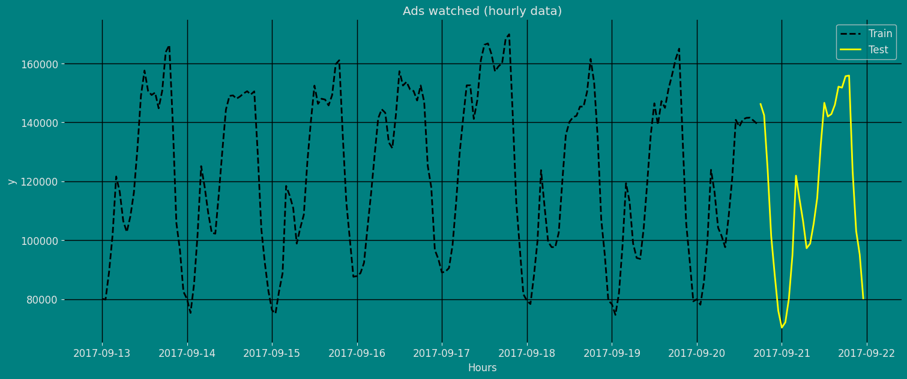

## Implementation of MSTL Method with StatsForecast <a class="anchor" id="implementation"></a>

### Load libraries

```python
from statsforecast import StatsForecast
from statsforecast.models import MSTL, AutoARIMA
```

### Instantiating Model

Import and instantiate the models. Setting the argument is sometimes
tricky. This article on [Seasonal
periods](https://robjhyndman.com/hyndsight/seasonal-periods/) by the
master, Rob Hyndmann, can be useful for `season_length`.

First, we must define the model parameters. As mentioned before, the
Candy production load presents seasonalities every 24 hours (Hourly) and
every 24 \* 7 (Daily) hours. Therefore, we will use `[24, 24 * 7]` for
season length. The trend component will be forecasted with an
`AutoARIMA` model. (You can also try with: `AutoTheta`, `AutoCES`, and
`AutoETS`)

```python
from statsforecast.utils import ConformalIntervals
horizon = len(test) # number of predictions

models = [MSTL(season_length=[24, 168], # seasonalities of the time series
trend_forecaster=AutoARIMA(prediction_intervals=ConformalIntervals(n_windows=3, h=horizon)))]
```

We fit the models by instantiating a new StatsForecast object with the
following parameters:

models: a list of models. Select the models you want from models and
import them.

-   `freq:` a string indicating the frequency of the data. (See [pandas’
    available
    frequencies](https://pandas.pydata.org/pandas-docs/stable/user_guide/timeseries.html#offset-aliases).)

-   `n_jobs:` n_jobs: int, number of jobs used in the parallel
    processing, use -1 for all cores.

-   `fallback_model:` a model to be used if a model fails.

Any settings are passed into the constructor. Then you call its fit
method and pass in the historical data frame.

```python
sf = StatsForecast(models=models, freq='h')
```

### Fit Model

```python
sf.fit(df=train)
```

``` text
StatsForecast(models=[MSTL])
```

Let’s see the results of our `MSTL Model`. We can observe it with the
following instruction:

```python
result=sf.fitted_[0,0].model_
result
```

|     | data     | trend         | seasonal24    | seasonal168  | remainder    |
|-----|----------|---------------|---------------|--------------|--------------|
| 0   | 80115.0  | 126222.558267 | -42511.086107 | -1524.379074 | -2072.093085 |
| 1   | 79885.0  | 126191.340644 | -43585.928105 | -1315.292640 | -1405.119899 |
| 2   | 89325.0  | 126160.117727 | -36756.458517 | 659.187427   | -737.846637  |
| ... | ...      | ...           | ...           | ...          | ...          |
| 183 | 141590.0 | 120314.325647 | 25363.015190  | -2808.715638 | -1278.625199 |
| 184 | 140610.0 | 120280.850692 | 26306.688690  | -6221.712712 | 244.173330   |
| 185 | 139515.0 | 120247.361703 | 27571.777796  | -5745.053631 | -2559.085868 |

```python
sf.fitted_[0, 0].model_.tail(24 * 28).plot(subplots=True, grid=True)
plt.tight_layout()
plt.show()
```

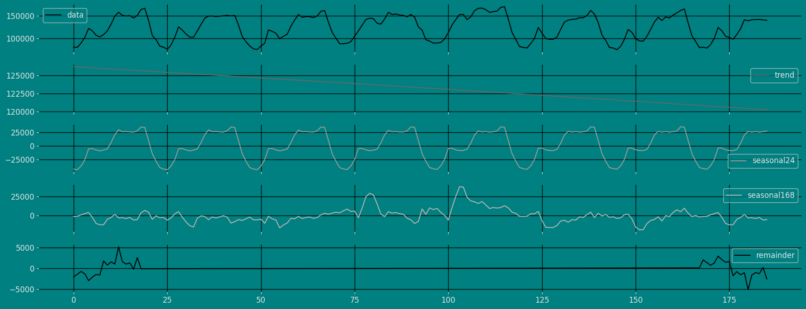

### Forecast Method

If you want to gain speed in productive settings where you have multiple
series or models we recommend using the `StatsForecast.forecast` method
instead of `.fit` and `.predict`.

The main difference is that the `.forecast` doest not store the fitted
values and is highly scalable in distributed environments.

The forecast method takes two arguments: forecasts next `h` (horizon)
and `level`.

-   `h (int):` represents the forecast h steps into the future. In this
    case, 30 hours ahead.

-   `level (list of floats):` this optional parameter is used for
    probabilistic forecasting. Set the level (or confidence percentile)
    of your prediction interval. For example, `level=[90]` means that
    the model expects the real value to be inside that interval 90% of
    the times.

The forecast object here is a new data frame that includes a column with
the name of the model and the y hat values, as well as columns for the
uncertainty intervals. Depending on your computer, this step should take
around 1min. (If you want to speed things up to a couple of seconds,
remove the AutoModels like `ARIMA` and `Theta`)

```python
Y_hat = sf.forecast(df=train, h=horizon, fitted=True)
Y_hat
```

|     | unique_id | ds                  | MSTL          |
|-----|-----------|---------------------|---------------|
| 0   | 1         | 2017-09-20 18:00:00 | 157848.500000 |
| 1   | 1         | 2017-09-20 19:00:00 | 159790.328125 |
| 2   | 1         | 2017-09-20 20:00:00 | 133002.281250 |
| ... | ...       | ...                 | ...           |
| 27  | 1         | 2017-09-21 21:00:00 | 98109.875000  |
| 28  | 1         | 2017-09-21 22:00:00 | 86342.015625  |
| 29  | 1         | 2017-09-21 23:00:00 | 76815.976562  |

```python
values=sf.forecast_fitted_values()
values.head()
```

|     | unique_id | ds                  | y        | MSTL          |
|-----|-----------|---------------------|----------|---------------|
| 0   | 1         | 2017-09-13 00:00:00 | 80115.0  | 79990.851562  |
| 1   | 1         | 2017-09-13 01:00:00 | 79885.0  | 79329.132812  |
| 2   | 1         | 2017-09-13 02:00:00 | 89325.0  | 88401.179688  |
| 3   | 1         | 2017-09-13 03:00:00 | 101930.0 | 102109.929688 |
| 4   | 1         | 2017-09-13 04:00:00 | 121630.0 | 123543.671875 |

```python
StatsForecast.plot(values)
```

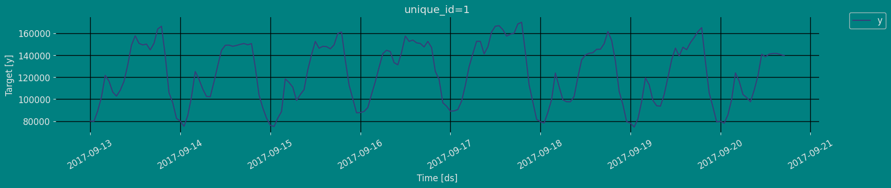

Adding 95% confidence interval with the forecast method

```python
sf.forecast(df=train, h=horizon, level=[95])
```

|     | unique_id | ds                  | MSTL          | MSTL-lo-95    | MSTL-hi-95    |
|-----|-----------|---------------------|---------------|---------------|---------------|
| 0   | 1         | 2017-09-20 18:00:00 | 157848.500000 | 157796.406250 | 157900.593750 |
| 1   | 1         | 2017-09-20 19:00:00 | 159790.328125 | 159714.218750 | 159866.437500 |
| 2   | 1         | 2017-09-20 20:00:00 | 133002.281250 | 132893.937500 | 133110.609375 |
| ... | ...       | ...                 | ...           | ...           | ...           |
| 27  | 1         | 2017-09-21 21:00:00 | 98109.875000  | 95957.031250  | 100262.726562 |
| 28  | 1         | 2017-09-21 22:00:00 | 86342.015625  | 85410.578125  | 87273.460938  |
| 29  | 1         | 2017-09-21 23:00:00 | 76815.976562  | 73476.195312  | 80155.757812  |

```python
sf.plot(train, Y_hat)
```

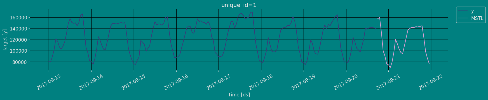

### Predict method with confidence interval

To generate forecasts use the predict method.

The predict method takes two arguments: forecasts the next `h` (for
horizon) and `level`.

-   `h (int):` represents the forecast h steps into the future. In this
    case, 30 hours ahead.

-   `level (list of floats):` this optional parameter is used for
    probabilistic forecasting. Set the level (or confidence percentile)
    of your prediction interval. For example, `level=[95]` means that
    the model expects the real value to be inside that interval 95% of
    the times.

The forecast object here is a new data frame that includes a column with
the name of the model and the y hat values, as well as columns for the
uncertainty intervals.

This step should take less than 1 second.

```python
sf.predict(h=horizon)
```

|     | unique_id | ds                  | MSTL          |
|-----|-----------|---------------------|---------------|
| 0   | 1         | 2017-09-20 18:00:00 | 157848.500000 |
| 1   | 1         | 2017-09-20 19:00:00 | 159790.328125 |
| 2   | 1         | 2017-09-20 20:00:00 | 133002.281250 |
| ... | ...       | ...                 | ...           |
| 27  | 1         | 2017-09-21 21:00:00 | 98109.875000  |
| 28  | 1         | 2017-09-21 22:00:00 | 86342.015625  |
| 29  | 1         | 2017-09-21 23:00:00 | 76815.976562  |

```python
forecast_df = sf.predict(h=horizon, level=[80,95])
forecast_df
```

|     | unique_id | ds                  | MSTL          | MSTL-lo-95    | MSTL-lo-80    | MSTL-hi-80    | MSTL-hi-95    |
|-----|-----------|---------------------|---------------|---------------|---------------|---------------|---------------|
| 0   | 1         | 2017-09-20 18:00:00 | 157848.500000 | 157796.406250 | 157798.484375 | 157898.531250 | 157900.593750 |
| 1   | 1         | 2017-09-20 19:00:00 | 159790.328125 | 159714.218750 | 159716.187500 | 159864.468750 | 159866.437500 |
| 2   | 1         | 2017-09-20 20:00:00 | 133002.281250 | 132893.937500 | 132894.515625 | 133110.031250 | 133110.609375 |
| ... | ...       | ...                 | ...           | ...           | ...           | ...           | ...           |
| 27  | 1         | 2017-09-21 21:00:00 | 98109.875000  | 95957.031250  | 96493.921875  | 99725.828125  | 100262.726562 |
| 28  | 1         | 2017-09-21 22:00:00 | 86342.015625  | 85410.578125  | 85411.835938  | 87272.195312  | 87273.460938  |
| 29  | 1         | 2017-09-21 23:00:00 | 76815.976562  | 73476.195312  | 74494.546875  | 79137.406250  | 80155.757812  |

```python
sf.plot(train, forecast_df, level=[80, 95])
```

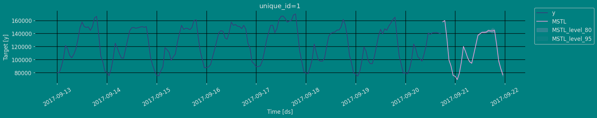

## Cross-validation <a class="anchor" id="cross_validate"></a>

In previous steps, we’ve taken our historical data to predict the
future. However, to asses its accuracy we would also like to know how
the model would have performed in the past. To assess the accuracy and
robustness of your models on your data perform Cross-Validation.

With time series data, Cross Validation is done by defining a sliding
window across the historical data and predicting the period following
it. This form of cross-validation allows us to arrive at a better
estimation of our model’s predictive abilities across a wider range of
temporal instances while also keeping the data in the training set
contiguous as is required by our models.

The following graph depicts such a Cross Validation Strategy:


### Perform time series cross-validation

Cross-validation of time series models is considered a best practice but
most implementations are very slow. The statsforecast library implements
cross-validation as a distributed operation, making the process less
time-consuming to perform. If you have big datasets you can also perform
Cross Validation in a distributed cluster using Ray, Dask or Spark.

In this case, we want to evaluate the performance of each model for the
last 5 months `(n_windows=)`, forecasting every second months
`(step_size=50)`. Depending on your computer, this step should take
around 1 min.

The cross_validation method from the StatsForecast class takes the
following arguments.

-   `df:` training data frame

-   `h (int):` represents h steps into the future that are being
    forecasted. In this case, 500 hours ahead.

-   `step_size (int):` step size between each window. In other words:
    how often do you want to run the forecasting processes.

-   `n_windows(int):` number of windows used for cross validation. In
    other words: what number of forecasting processes in the past do you
    want to evaluate.

```python
crossvalidation_df = sf.cross_validation(df=df,
                                         h=horizon,
                                         step_size=30,
                                         n_windows=5)
```

The crossvaldation_df object is a new data frame that includes the
following columns:

-   `unique_id:` series identifier
-   `ds:` datestamp or temporal index
-   `cutoff:` the last datestamp or temporal index for the `n_windows`.
-   `y:` true value
-   `model:` columns with the model’s name and fitted value.

```python
crossvalidation_df
```

|     | unique_id | ds                  | cutoff              | y        | MSTL          |
|-----|-----------|---------------------|---------------------|----------|---------------|
| 0   | 1         | 2017-09-15 18:00:00 | 2017-09-15 17:00:00 | 159725.0 | 158384.250000 |
| 1   | 1         | 2017-09-15 19:00:00 | 2017-09-15 17:00:00 | 161085.0 | 162015.171875 |
| 2   | 1         | 2017-09-15 20:00:00 | 2017-09-15 17:00:00 | 135520.0 | 138495.093750 |
| ... | ...       | ...                 | ...                 | ...      | ...           |
| 147 | 1         | 2017-09-21 21:00:00 | 2017-09-20 17:00:00 | 103080.0 | 98109.875000  |
| 148 | 1         | 2017-09-21 22:00:00 | 2017-09-20 17:00:00 | 95155.0  | 86342.015625  |
| 149 | 1         | 2017-09-21 23:00:00 | 2017-09-20 17:00:00 | 80285.0  | 76815.976562  |

We’ll now plot the forecast for each cutoff period. To make the plots
clearer, we’ll rename the actual values in each period.

```python
from IPython.display import display

cross_validation=crossvalidation_df.copy()
cross_validation.rename(columns = {'y' : 'actual'}, inplace = True) # rename actual values

cutoff = cross_validation['cutoff'].unique()

for k in range(len(cutoff)):
    cv = cross_validation[cross_validation['cutoff'] == cutoff[k]]
    display(StatsForecast.plot(df, cv.loc[:, cv.columns != 'cutoff']))
```

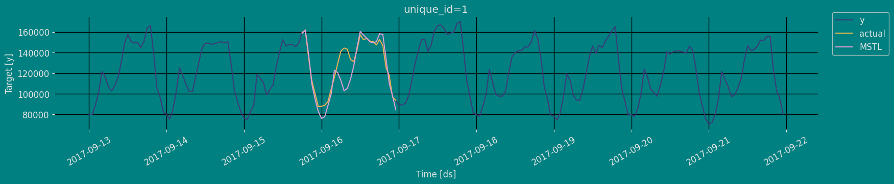

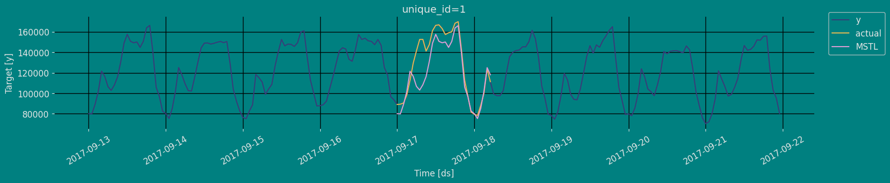

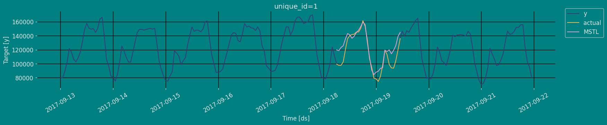

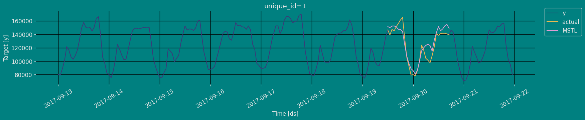

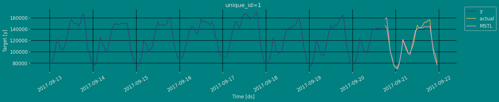

## Model Evaluation <a class="anchor" id="evaluate"></a>

Now we are going to evaluate our model with the results of the
predictions, we will use different types of metrics MAE, MAPE, MASE,
RMSE, SMAPE to evaluate the accuracy.

```python
from functools import partial

import utilsforecast.losses as ufl
from utilsforecast.evaluation import evaluate
```


```python
evaluate(
    test.merge(Y_hat),
    metrics=[ufl.mae, ufl.mape, partial(ufl.mase, seasonality=24), ufl.rmse, ufl.smape],
    train_df=train,
)
```

|     | unique_id | metric | MSTL        |
|-----|-----------|--------|-------------|
| 0   | 1         | mae    | 4932.395052 |
| 1   | 1         | mape   | 0.040514    |
| 2   | 1         | mase   | 0.609407    |
| 3   | 1         | rmse   | 6495.207028 |
| 4   | 1         | smape  | 0.020267    |

## References <a class="anchor" id="references"></a>

1.  [Changquan Huang • Alla Petukhina. Springer series (2022). Applied
    Time Series Analysis and Forecasting with
    Python.](https://link.springer.com/book/10.1007/978-3-031-13584-2)
2.  Ivan Svetunkov. [Forecasting and Analytics with the Augmented
    Dynamic Adaptive Model (ADAM)](https://openforecast.org/adam/)
3.  [James D. Hamilton. Time Series Analysis Princeton University Press,
    Princeton, New Jersey, 1st Edition,
    1994.](https://press.princeton.edu/books/hardcover/9780691042893/time-series-analysis)
4.  [Nixtla MultipleSeasonalTrend API](../../models#class-mstl)
5.  [Pandas available
    frequencies](https://pandas.pydata.org/pandas-docs/stable/user_guide/timeseries.html#offset-aliases).
6.  [Rob J. Hyndman and George Athanasopoulos (2018). “Forecasting
    Principles and Practice (3rd
    ed)”](https://otexts.com/fpp3/tscv.html).
7.  [Seasonal periods- Rob J
    Hyndman](https://robjhyndman.com/hyndsight/seasonal-periods/).

