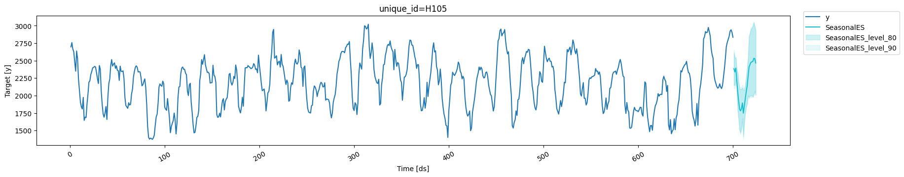

> Learn how to generate calibrated prediction intervals for any
> forecasting model using conformal prediction, a distribution-free
> method for uncertainty quantification in Python.

## What You’ll Learn

In this tutorial, you’ll discover how to:

-   Generate **calibrated prediction intervals** without distributional
    assumptions
-   Apply conformal prediction to any forecasting model in Python
-   Implement uncertainty quantification with StatsForecast’s
    `ConformalIntervals`
-   Compare conformal prediction with traditional uncertainty methods
-   Evaluate prediction interval coverage and calibration

## Prerequisites

This tutorial assumes basic familiarity with StatsForecast. For a
minimal example visit the [Quick
Start](../getting-started/1_Getting_Started_short)

## What is Conformal Prediction?

**Conformal prediction** is a distribution-free framework for generating
prediction intervals with guaranteed coverage properties. Unlike
traditional methods that assume normally distributed errors, conformal
prediction works with any forecasting model and provides
**well-calibrated uncertainty estimates** without making distributional
assumptions.

### Why Use Conformal Prediction for Time Series?

When generating forecasts, a point forecast alone doesn’t convey
uncertainty. **Prediction intervals** quantify this uncertainty by
providing a range of values where future observations are likely to
fall. A properly calibrated 95% prediction interval should contain the
actual value 95% of the time.

The challenge: many forecasting models either don’t provide prediction
intervals, or generate intervals that are poorly calibrated. Traditional
statistical methods also assume normality, which often doesn’t hold in
practice.

**Conformal prediction solves this by:**

-   Working with any forecasting model (model-agnostic)
-   Requiring no distributional assumptions
-   Using cross-validation to generate calibrated intervals
-   Providing theoretical coverage guarantees
-   Treating the forecasting model as a black box

### Conformal Prediction vs. Traditional Methods

| Method                          | Distributional Assumption | Model-Agnostic | Calibration Guarantee |
|---------|--------------------------|----------------|----------------------|
| **Conformal Prediction**        | None                      | ✓              | ✓                     |
| Bootstrap                       | Parametric assumptions    | ✓              | ~                     |
| Quantile Regression             | None                      | ✓              | ~                     |
| Statistical Models (ARIMA, ETS) | Normal errors             | ✗              | ~                     |

For a video introduction, see the [PyData Seattle
presentation](https://www.youtube.com/watch?v=Bj1U-Rrxk48). More
resources available in [Valery Manokhin’s curated
list](https://github.com/valeman/awesome-conformal-prediction).

## Models with Native Prediction Intervals

For models that already provide forecast distributions (like AutoARIMA,
AutoETS), check [Prediction Intervals](./UncertaintyIntervals).
Conformal prediction is particularly useful for models that only produce
point forecasts, or when you want distribution-free intervals.

## How Conformal Prediction Works

Conformal prediction uses **cross-validation** to generate prediction
intervals:

1.  **Split the training data** into multiple windows
2.  **Train the model** on each window and forecast the next period
3.  **Calculate residuals** (prediction errors) on the held-out data
4.  **Construct intervals** using the distribution of these residuals

The key insight: by studying how the model performs on historical data
through cross-validation, we can quantify uncertainty for future
predictions without assuming any particular error distribution.

### Real-World Applications

Conformal prediction is particularly valuable for:

-   **Demand forecasting**: Inventory planning with quantified
    uncertainty
-   **Energy prediction**: Load forecasting with reliable confidence
    bounds
-   **Financial forecasting**: Risk management with calibrated intervals
-   **Production models**: Any black-box forecasting model requiring
    uncertainty quantification

[StatsForecast](../../index) implements conformal prediction for all
available models, making it easy to add calibrated prediction intervals
to any forecasting pipeline.

## Install libraries

We assume that you have StatsForecast already installed. If not, check
this guide for instructions on [how to install
StatsForecast](../getting-started/0_Installation)

Install the necessary packages using `pip install statsforecast`

```python
%%capture
pip install statsforecast -U
```

## Load and explore the data

For this example, we’ll use the hourly dataset from the [M4
Competition](https://www.sciencedirect.com/science/article/pii/S0169207019301128).
We first need to download the data from a URL and then load it as a
`pandas` dataframe. Notice that we’ll load the train and the test data
separately. We’ll also rename the `y` column of the test data as
`y_test`.

```python
import pandas as pd
```


```python
train = pd.read_csv('https://auto-arima-results.s3.amazonaws.com/M4-Hourly.csv')
test = pd.read_csv('https://auto-arima-results.s3.amazonaws.com/M4-Hourly-test.csv').rename(columns={'y': 'y_test'})
train.head()
```

|     | unique_id | ds  | y     |
|-----|-----------|-----|-------|
| 0   | H1        | 1   | 605.0 |
| 1   | H1        | 2   | 586.0 |
| 2   | H1        | 3   | 586.0 |
| 3   | H1        | 4   | 559.0 |
| 4   | H1        | 5   | 511.0 |

Since the goal of this notebook is to generate prediction intervals,
we’ll only use the first 8 series of the dataset to reduce the total
computational time.

```python
n_series = 8
uids = train['unique_id'].unique()[:n_series] # select first n_series of the dataset
train = train.query('unique_id in @uids')
test = test.query('unique_id in @uids')
```

We can plot these series using the `plot_series` function from the
utilsforecast library. Thisfunctionmethod has multiple parameters, and
the required ones to generate the plots in this notebook are explained
below.

-   `df`: A `pandas` dataframe with columns \[`unique_id`, `ds`, `y`\].
-   `forecasts_df`: A `pandas` dataframe with columns \[`unique_id`,
    `ds`\] and models.
-   `plot_random`: bool = `True`. Plots the time series randomly.
-   `models`: List\[str\]. A list with the models we want to plot.
-   `level`: List\[float\]. A list with the prediction intervals we want
    to plot.
-   `engine`: str = `matplotlib`. It can also be `plotly`. `plotly`
    generates interactive plots, while `matplotlib` generates static
    plots.

```python
from utilsforecast.plotting import plot_series
```


```python
plot_series(train, test, plot_random=False)
```


## Implementing Conformal Prediction in Python

StatsForecast makes it simple to add conformal prediction to any
forecasting model. We’ll demonstrate with models that don’t natively
provide prediction intervals:

-   **[SeasonalExponentialSmoothing](../models/SimpleExponentialSmoothing)**:
    A simple smoothing model
-   **[ADIDA](../models/ADIDA)**: Aggregation method for intermittent
    demand
-   **[ARIMA](../models/ARIMA)**: Traditional statistical model (to show
    distribution-free intervals)

### Setting Up Conformal Intervals

The key is the `ConformalIntervals` class, which requires two
parameters:

-   `h`: Forecast horizon (how many steps ahead to predict)
-   `n_windows`: Number of cross-validation windows for calibration

### Parameter Requirements

-   `n_windows * h` must be less than your time series length
-   `n_windows` should be at least 2 for reliable calibration
-   Larger `n_windows` improves calibration but increases computation
    time

```python
from statsforecast.models import SeasonalExponentialSmoothing, ADIDA, ARIMA
from statsforecast.utils import ConformalIntervals

# Create a list of models and instantiation parameters
intervals = ConformalIntervals(h=24, n_windows=2)
# P.S. n_windows*h should be less than the count of data elements in your time series sequence.
# P.S. Also value of n_windows should be atleast 2 or more.

models = [
    SeasonalExponentialSmoothing(season_length=24, alpha=0.1, prediction_intervals=intervals),
    ADIDA(prediction_intervals=intervals),
    ARIMA(order=(24,0,12), prediction_intervals=intervals),
]
```

To instantiate a new StatsForecast object, we need the following
parameters:

-   `df`: The dataframe with the training data.
-   `models`: The list of models defined in the previous step.  
-   `freq`: A string indicating the frequency of the data. See [pandas’
    available
    frequencies](https://pandas.pydata.org/pandas-docs/stable/user_guide/timeseries.html#offset-aliases).
-   `n_jobs`: An integer that indicates the number of jobs used in
    parallel processing. Use -1 to select all cores.

```python
sf = StatsForecast(models=models, freq=1, n_jobs=-1)
```

## Generating Forecasts with Prediction Intervals

The `forecast` method generates both point forecasts and conformal
prediction intervals:

-   `h`: Forecast horizon (number of steps ahead)
-   `level`: List of confidence levels (e.g., `[80, 90]` for 80% and 90%
    intervals)

The output includes columns for each model’s forecast and corresponding
prediction interval bounds (`model-lo-{level}`, `model-hi-{level}`).

```python
levels = [80, 90] # confidence levels of the prediction intervals

forecasts = sf.forecast(df=train, h=24, level=levels)
forecasts.head()
```

|     | unique_id | ds  | SeasonalES | SeasonalES-lo-90 | SeasonalES-lo-80 | SeasonalES-hi-80 | SeasonalES-hi-90 | ADIDA      | ADIDA-lo-90 | ADIDA-lo-80 | ADIDA-hi-80 | ADIDA-hi-90 | ARIMA      | ARIMA-lo-90 | ARIMA-lo-80 | ARIMA-hi-80 | ARIMA-hi-90 |
|-----|-----------|-----|------------|------------------|------------------|------------------|------------------|------------|-------------|-------------|-------------|-------------|------------|-------------|-------------|-------------|-------------|
| 0   | H1        | 701 | 624.132703 | 553.097423       | 556.359139       | 691.906266       | 695.167983       | 747.292568 | 599.519220  | 600.030467  | 894.554670  | 895.065916  | 618.078274 | 609.440076  | 610.583304  | 625.573243  | 626.716472  |
| 1   | H1        | 702 | 555.698193 | 496.653559       | 506.833156       | 604.563231       | 614.742827       | 747.292568 | 491.669220  | 498.330467  | 996.254670  | 1002.915916 | 549.789291 | 510.464070  | 515.232352  | 584.346231  | 589.114513  |
| 2   | H1        | 703 | 514.403029 | 462.673117       | 464.939840       | 563.866218       | 566.132941       | 747.292568 | 475.105038  | 475.793791  | 1018.791346 | 1019.480099 | 508.099925 | 496.574844  | 496.990264  | 519.209587  | 519.625007  |
| 3   | H1        | 704 | 482.057899 | 433.030711       | 436.161413       | 527.954385       | 531.085087       | 747.292568 | 440.069220  | 440.130467  | 1054.454670 | 1054.515916 | 486.376622 | 471.141813  | 471.516997  | 501.236246  | 501.611431  |
| 4   | H1        | 705 | 460.222522 | 414.270186       | 416.959492       | 503.485552       | 506.174858       | 747.292568 | 415.805038  | 416.193791  | 1078.391346 | 1078.780099 | 470.159478 | 445.162316  | 446.808608  | 493.510348  | 495.156640  |

## Visualizing Calibrated Prediction Intervals

Let’s examine the prediction intervals for each model to understand
their characteristics and calibration quality.

### SeasonalExponentialSmoothing: Well-Calibrated Intervals

The conformal prediction intervals show proper nesting: the 80% interval
is contained within the 90% interval, indicating well-calibrated
uncertainty quantification. Even though this model only produces point
forecasts, conformal prediction successfully generates meaningful
prediction intervals.

```python
plot_series(train, forecasts, level=levels, ids=['H105'], models=['SeasonalES'])
```



### ADIDA: Wider Intervals for Weaker Models

Models with higher prediction errors produce wider conformal intervals.
This is a feature, not a bug: the interval width honestly reflects the
model’s uncertainty. A better-fitting model will produce narrower, more
informative intervals.

```python
plot_series(train, forecasts, level=levels, ids=['H105'], models=['ADIDA'])
```


### ARIMA: Distribution-Free Alternative

ARIMA models typically provide prediction intervals assuming normally
distributed errors. By using conformal prediction, we get
distribution-free intervals that don’t rely on this assumption, which is
valuable when the normality assumption is questionable.

```python
plot_series(train, forecasts, level=levels, ids=['H105'], models=['ARIMA'])
```


## Alternative: Setting Conformal Intervals on StatsForecast Object

You can apply conformal prediction to all models at once by specifying
`prediction_intervals` in the `StatsForecast` object. This is convenient
when you want the same conformal setup for multiple models.

```python
from statsforecast.models import SimpleExponentialSmoothing, ADIDA
from statsforecast.utils import ConformalIntervals
from statsforecast import StatsForecast

models = [
    SimpleExponentialSmoothing(alpha=0.1),
    ADIDA()
]

res = StatsForecast(
    models=models,
    freq=1,
).forecast(df=train, h=24, prediction_intervals=ConformalIntervals(h=24, n_windows=2), level=[80])
res.head()
```

|     | unique_id | ds  | SES        | SES-lo-80  | SES-hi-80   | ADIDA      | ADIDA-lo-80 | ADIDA-hi-80 |
|-----|-----------|-----|------------|------------|-------------|------------|-------------|-------------|
| 0   | H1        | 701 | 742.669064 | 649.221405 | 836.116722  | 747.292568 | 600.030467  | 894.554670  |
| 1   | H1        | 702 | 742.669064 | 550.551324 | 934.786804  | 747.292568 | 498.330467  | 996.254670  |
| 2   | H1        | 703 | 742.669064 | 523.621405 | 961.716722  | 747.292568 | 475.793791  | 1018.791346 |
| 3   | H1        | 704 | 742.669064 | 488.121405 | 997.216722  | 747.292568 | 440.130467  | 1054.454670 |
| 4   | H1        | 705 | 742.669064 | 464.021405 | 1021.316722 | 747.292568 | 416.193791  | 1078.391346 |

## Future work

Conformal prediction has become a powerful framework for uncertainty
quantification, providing well-calibrated prediction intervals without
making any distributional assumptions. Its use has surged in both
academia and industry over the past few years. We’ll continue working on
it, and future tutorials may include:

-   Exploring larger datasets
-   Incorporating industry-specific examples
-   Investigating specialized methods like the jackknife+ that are
    closely related to conformal prediction (for details on the
    jackknife+ see
    [here](https://valeman.medium.com/jackknife-a-swiss-knife-of-conformal-prediction-for-regression-ce3b56432f4f))

If you’re interested in any of these, or in any other related topic,
please let us know by opening an issue on
[GitHub](https://github.com/Nixtla/statsforecast/issues)

## Key Takeaways

### Summary: Conformal Prediction for Time Series

-   **Model-agnostic**: Works with any forecasting model in Python  
-   **Distribution-free**: No normality assumptions required  
-   **Well-calibrated**: Theoretical coverage guarantees  
-   **Easy to implement**: Just add `ConformalIntervals` to your
    StatsForecast models  
-   **Flexible**: Apply to individual models or all models at once

**Next steps:**

-   Try conformal prediction on your own forecasting problems
-   Experiment with different `n_windows` values for optimal calibration
-   Compare with native prediction intervals from statistical models
-   Explore [advanced uncertainty quantification
    methods](./UncertaintyIntervals)

## Acknowledgements

We would like to thank [Kevin Kho](https://github.com/kvnkho) for
writing this tutorial, and Valeriy
[Manokhin](https://github.com/valeman) for his expertise on conformal
prediction, as well as for promoting this work.

## References

[Manokhin, Valery. (2022). Machine Learning for Probabilistic
Prediction. 10.5281/zenodo.6727505.](https://zenodo.org/record/6727505)

