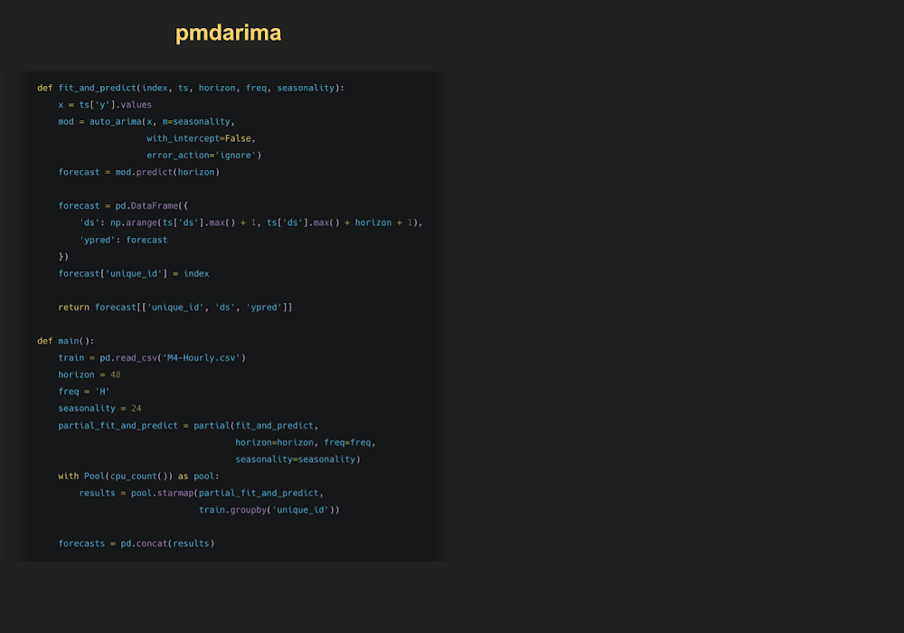

# ARIMA experiments

## Main results

We compared accuracy and speed against [pmdarima](https://github.com/alkaline-ml/pmdarima), Rob Hyndman's [forecast](https://github.com/robjhyndman/forecast) package and Facebook's [Prophet](https://github.com/facebook/prophet). We used the `Daily`, `Hourly` and `Weekly` data from the [M4 competition](https://www.sciencedirect.com/science/article/pii/S0169207019301128). 

The following table summarizes the results. As can be seen, our `auto_arima` is the best model in accuracy (measured by the `MASE` loss) and time, even compared with the original implementation in R.

| dataset   | metric   |   auto_arima_nixtla | auto_arima_pmdarima [1] |   auto_arima_r |   prophet |
|:----------|:---------|--------------------:|----------------------:|---------------:|----------:|
| Daily     | MASE     |                **3.26** |                  3.35 |           4.46 |     14.26 |
| Daily     | time     |                **1.41** |                 27.61 |           1.81 |    514.33 |
| Hourly    | MASE     |                **0.92** |                ---    |           1.02 |      1.78 |
| Hourly    | time     |               **12.92** |                ---    |          23.95 |     17.27 |
| Weekly    | MASE     |                **2.34** |                  2.47 |           2.58 |      7.29 |
| Weekly    | time     |                0.42 |                  2.92 |           **0.22** |     19.82 |

[1] The model `auto_arima` from `pmdarima` had a problem with Hourly data. An issue was opened.

The following table summarizes the data details.
 
| group   | n_series   | mean_length   | std_length   |   min_length | max_length   |
|:--------|-----------:|--------------:|-------------:|-------------:|-------------:|
| Daily   | 4,227      | 2,371         | 1,756        |          107 | 9,933        |
| Hourly  | 414        | 901           | 127          |          748 | 1,008        |
| Weekly  | 359        | 1,035         | 707          |           93 | 2,610        | 

### ⏲ Computational efficiency

We measured the computational time against the number of time series. The following graph shows the results. As we can see, the fastest model is our `auto_arima`.

    
 Nixtla vs Prophet 
 
     

You can reproduce the results [here](/experiments/arima/).

### External regressors

Results with external regressors are qualitatively similar to the ones reported before. You can find the complete experiments [here](/experiments/arima_xreg/).

## 👾 Less code

## Reproducibility

To reproduce the main results you have:

1. Execute `make init` to create a Docker image with the required dependencies.
2. Run the experiments using `make run_module module="python -m src.[model] --dataset M4 --group [group]"` where `[model]` can be `statsforecast`, `pmdarima` and `prophet`, and `[group]` can be `Daily`, `Hourly` and `Weekly`.
3. To run R experiments you have to prepare the data using `make run_module module="python -m src.data --dataset M4 --group [group]"` for each `[group]`. Once it is done, just run `make run_module module="Rscript src/arima_r.R [group]"`.
4. Finally, you can evaluate the forecasts using `make run_module module ="python -m src.evaluation"`.

