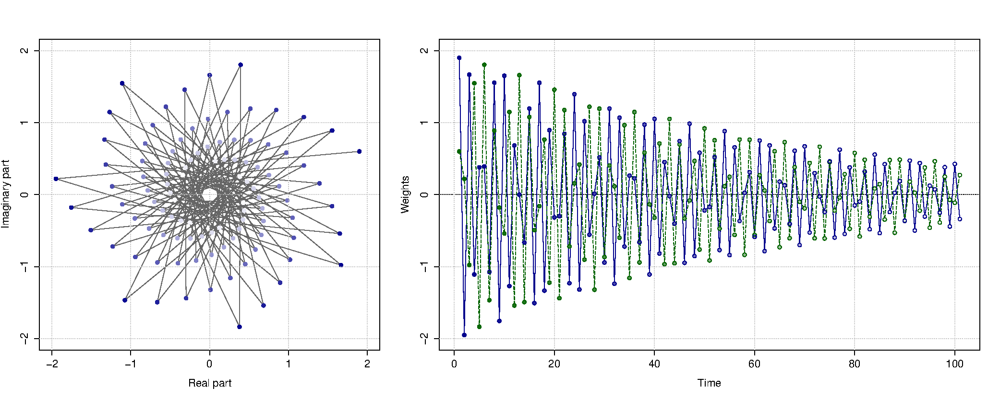
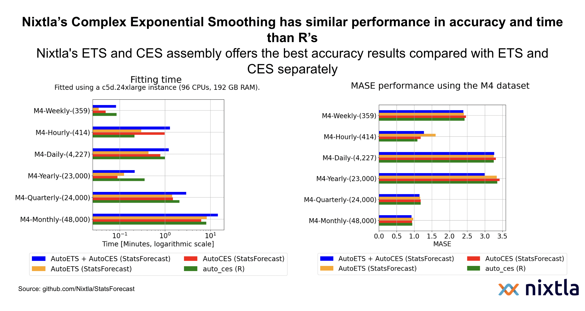
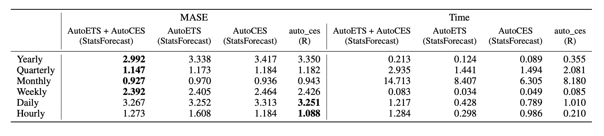
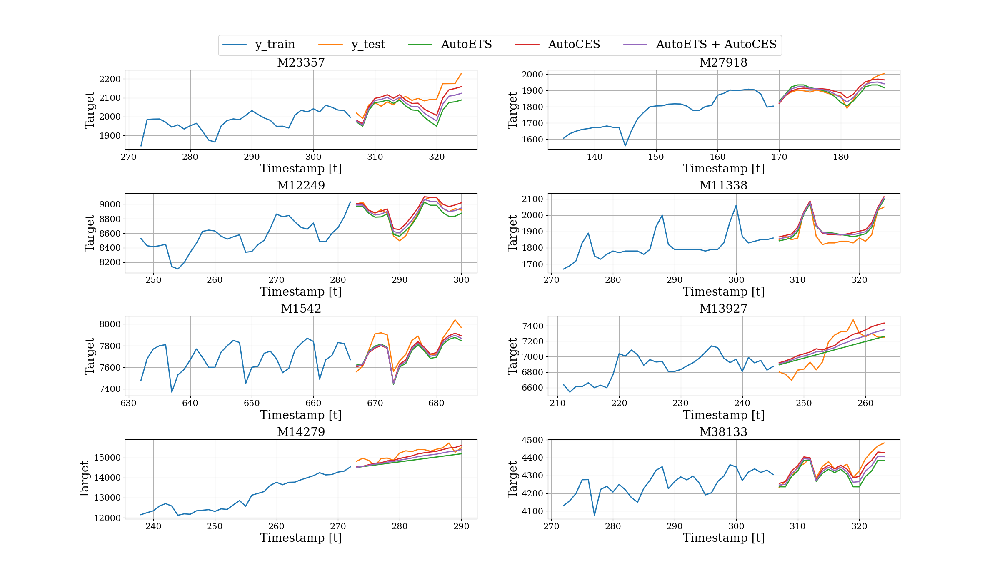

# Complex Exponential Smoothing (CES) is now available in Pyhton

We are excited to release the only implementation for Python of the Complex Exponential Smoothing Algorithm, originally developed by [Ivan Sventunkov](https://forecasting.svetunkov.ru/en/2022/08/02/complex-exponential-smoothing/) for R. The CES algorithm models the time series using “information potential”, modeling the non-linearity in time series using a complex-valued representation. The weights exponentially decrease over time on complex and real plains rather than the constant weights in simple moving average methods.

The CES model has two main advantages over conventional exponential smoothing models:
* it can model and forecast both stationary and non-stationary processes and
* it can capture both level and trend cases

Our implementation, optimized using numba, was tested on the M4 dataset (100k time series), getting similar accuracy and computational time results than the original implementation in R. 

Additionally, with StatsForecast you can easly build ensembles of all statstical models. In this experiment, we show how the ensemble between ETS and CES gives the best results.

## Main results

### Table

## Plots (Monthly dataset)

## References

* Check the StatsForecast [documentation](https://nixtla.github.io/statsforecast/models.html#autoces) on the CES
* [Link](https://forecasting.svetunkov.ru/wp-content/uploads/2022/07/Svetunkov-et-al.-2022-Complex-Exponential-Smoothing.pdf) to the original paper
* [Link](https://forecasting.svetunkov.ru/en/2022/08/02/the-long-and-winding-road-the-story-of-complex-exponential-smoothing/) to the story of the paper

## Reproducibility

To reproduce the main results you have:

1. Execute `make init`. 
2. Activate the environment using `conda activate ces`.
3. Run the experiments using `python -m src.ces --dataset M4 --group [group]` where `[model]` can be `[group]` can be `Hourly`, `Daily`, `Weekly`, `Monthly`, `Quarterly`, and `Yearly`.
4. Compute the ensemble model using `python -m src.ensemble --dataset M4 --group [group]` where `[model]` can be `[group]` can be `Hourly`, `Daily`, `Weekly`, `Monthly`, `Quarterly`, and `Yearly`.
4. To run R experiments you have to prepare the data using `python -m src.data --dataset M4 --group [group]` for each `[group]`. Once it is done, just run `make run_module module="Rscript src/ces_r.R [group]"`.
5. Finally you can evaluate the forecasts using `make run_module module="python -m src.evaluation"`.
