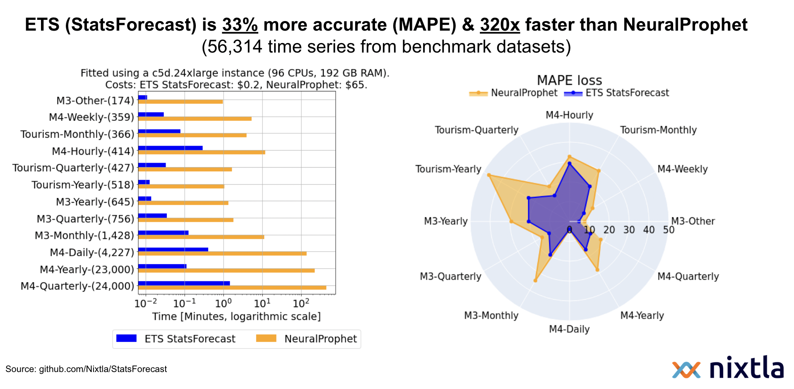
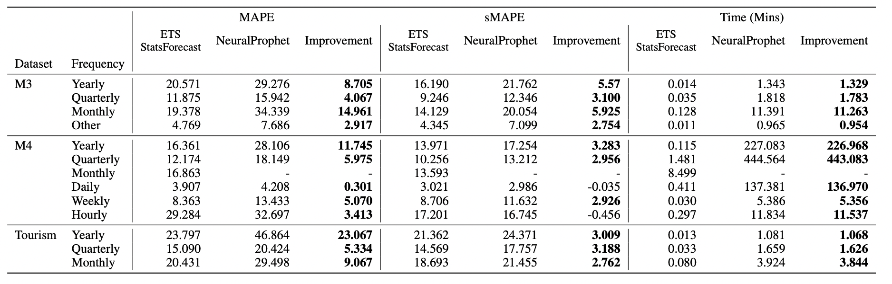

# ETS is faster and more accurate than NeuralProphet (in most cases). 

We benchmarked on more than 55K series and show that `ETS` improves _MAPE_ and _sMAPE_ forecast accuracy by _32%_ and _19%_, respectively, with _104x_ less computational time over [`NeuralProphet`](https://neuralprophet.com/html/index.html).

### Install StatsForecast
```bash
pip install statsforecast
```

## Results on ERCOT, ETTm2, M3, M4, and Tourism: 



## Background

In this experiment, we test [`NeuralProphet`](https://neuralprophet.com/html/index.html)'s introduction as a "successor" to Facebook-`Prophet` and compare it with classic Exponential Smoothing (`ETS`). We show that it is not the case that `ETS` has "too restrictive assumptions and parametric nature limit their performance in real-world applications" as claimed by `NeuralProphet`'s [paper](https://arxiv.org/pdf/2111.15397.pdf). Moreover, we show that `NeuralProphet`'s predictions are outperformed both in accuracy and computation time by this statistical model.

## Empirical validation

To compare `NeuralProphet` against `ETS`, we designed a pipeline considering the M3, M4, and Tourism datasets (standard benchmarks in the forecasting practice). In correspondence with the author he suggested to further test the model in electricity datasets and try including auto regresor and covariates. Therefore we also included the ERCOT dataset (used in the [`NeuralProphet`'s documentation](https://neuralprophet.com/html/lagged_covariates_energy_ercot.html#24-steps-ahead-Neural-Model-with-Long-AR-and-Lagged-Regressors)), and ETTm2. `NeuralProphet` fits the time series globally using autoregressive terms and produces forecasts using a multistep approach. 

### Notes

- We used the out-of-the-box configuration of the NeuralProphet model in its global-multistep version, using autoregressive terms based on the seasonality of the data and the forecast horizon. This experiment concludes that hyperparameter optimization could be highly costly, particularly for big datasets.
- For the ERCOT dataset, we used the `NeuralProphet` [configuration used in its documentation](https://neuralprophet.com/html/lagged_covariates_energy_ercot.html#24-steps-ahead-Neural-Model-with-Long-AR-and-Lagged-Regressors).
- Additionally, we test the performance of `NeuralProphet` using different learning rates (1e-5, 1e-4, 1e-3, 1e-2, 1e-1). The performance is similar.
- During the execution of the experiment, we found issues with the `NeuralProphet` implementation related to Monthly, Quarterly, and Yearly frequencies. We [fixed the issue and opened a Pull Request to solve the problem](https://github.com/ourownstory/neural_prophet/pull/705).
- According to the paper and a [discussion on GitHub](https://github.com/ourownstory/neural_prophet/discussions/408), the `NeuralProphet` implementation is not available in GPU. There is a [work-in-progress Pull Request](https://github.com/ourownstory/neural_prophet/pull/420), though. 
- We also performed experiments for the M4-Monthly data set, but `NeuralProphet` did not finish after three days of computation. `ETS` results are reported.

## Results 

The following table shows the _MAPE_, _sMAPE_, and _Time_ (in minutes) `ETS` improvements over `NeuralProphet` for each dataset.



Notes: 
* The author of the original paper asked us to point out that NeuralProphet was designed for medium length time-series (1k-1m observations) of higher frequency.

## Reproducibility


1. Create a conda environment `exp_neuralprophet` using the `environment.yml` file.
  ```shell
  conda env create -f environment.yml
  ```

3. Activate the conda environment using 
  ```shell
  conda activate exp_neuralprophet
  ```

4. Run the experiments for each dataset and each model using 
  ```shell
  python -m src.[model] --dataset [dataset] --group [group]
  ```

The variable `model` can be `statsforecast` (`ETS` model) or `neuralprophet`. For `M4`, the groups are `Yearly`, `Quarterly`, `Weekly`, `Daily`, and `Hourly`. For `M3`, the groups are `Yearly`, `Monthly`, `Quarterly`, and `Other`. For `Tourism`, the groups are `Yearly`, `Monthly`, and `Quarterly`. To run `ETTm2` use `LongHorizon` as dataset and `ETTm2` as group. To run `ERCOT` use `ERCOT` as dataset and `Other` as group. 

5. Evaluate the results using

  ```shell
  python -m src.evaluation
  ```

## Conclusion

* Always use strong baselines when forecasting.
* Quick and easy results are sometimes [misleading](https://en.wikipedia.org/wiki/Streetlight_effect).
* Simpler models are sometimes [better](https://en.wikipedia.org/wiki/Occam%27s_razor).
* Both Prophet and NeuralProphet are definitely **not** models for Forecasting at Scale. 
* We find the claim that __"NeuralProphet bridges the gap between traditional time-series models and deep learning methods."__ simply to be false, given that this model does not outperform classical statistical methods neither in accuracy nor speed.

## Misc.

* [`StatsForecast`](https://github.com/nixtla/statsforecast) also includes a variety of lightning fast baseline models.
* If you really need to do forecast at scale, [here](https://github.com/nixtla/statsforecast/tree/main/experiments/ray) we show how to forecast 1 million time series under 30 minutes using [Ray](https://github.com/ray-project/ray).
* If you are interested in SOTA Deep Learning models, check [`NeuralForecast`](https://github.com/nixtla/neuralforecast)


