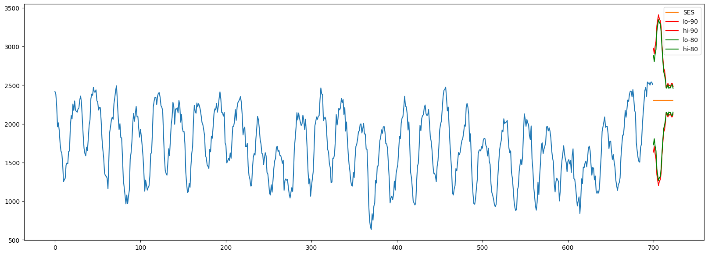
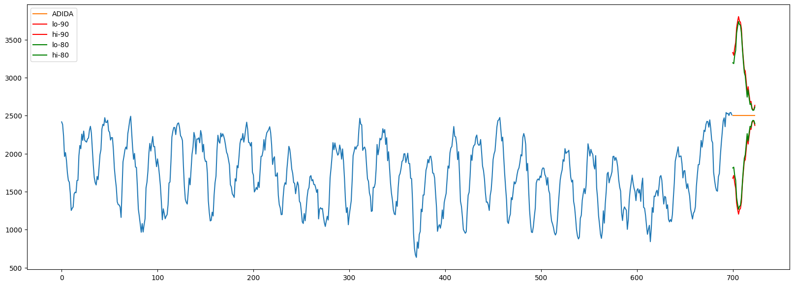

export const quartoRawHtml =
[`<div>
<style scoped>
    .dataframe tbody tr th:only-of-type {
        vertical-align: middle;
    }
    .dataframe tbody tr th {
        vertical-align: top;
    }
    .dataframe thead th {
        text-align: right;
    }
</style>
`,`
</div>`,`<div>
<style scoped>
    .dataframe tbody tr th:only-of-type {
        vertical-align: middle;
    }
    .dataframe tbody tr th {
        vertical-align: top;
    }
    .dataframe thead th {
        text-align: right;
    }
</style>
`,`
</div>`];

::: {.cell 0=‘h’ 1=‘i’ 2=‘d’ 3=‘e’}

<details>
<summary>Code</summary>

``` python
import warnings
warnings.simplefilter('ignore')

import logging
logging.getLogger('statsforecast').setLevel(logging.ERROR)
```

</details>

:::

> In this example, we’ll implement conformal prediction

:::warning

## Prerequisites

This tutorial assumes basic familiarity with StatsForecast. For a
minimal example visit the [Quick
Start](../getting-started/1_Getting_Started_short.ipynb)

:::

## Introduction {#introduction}

When we generate a forecast, we usually produce a single value known as
the point forecast. This value, however, doesn’t tell us anything about
the uncertainty associated with the forecast. To have a measure of this
uncertainty, we need **prediction intervals**.

A prediction interval is a range of values that the forecast can take
with a given probability. Hence, a 95% prediction interval should
contain a range of values that include the actual future value with
probability 95%. Probabilistic forecasting aims to generate the full
forecast distribution. Point forecasting, on the other hand, usually
returns the mean or the median or said distribution. However, in
real-world scenarios, it is better to forecast not only the most
probable future outcome, but many alternative outcomes as well.

The problem is that some timeseries models provide forecast
distributions, but some other ones only provide point forecasts. How can
we then estimate the uncertainty of predictions?

:::important

## Prediction Intervals

For models that already provide the forecast distribution, check
[Prediction Intervals](./UncertaintyIntervals.ipynb).

:::

### Conformal Prediction {#conformal-prediction}

For a video introduction, see the [PyData Seattle
presentation](https://www.youtube.com/watch?v=Bj1U-Rrxk48).

Multi-quantile losses and statistical models can provide provide
prediction intervals, but the problem is that these are uncalibrated,
meaning that they tend to ignore seasonality. Statistical methods also
assume normality. Here, we talk about another method called Conformal
Prediction. More information on the approach can be found in [this repo
owned by Valery
Manokhin](https://github.com/valeman/awesome-conformal-prediction).

Conformal prediction intervals use cross-validation on a point
forecaster model to generate the intervals. This means that no prior
probabilities are needed, and the output is well-calibrated. No
additional training is needed, and the model is treated as a black box.
This means that it is compatible with any model.

[Statsforecast](https://github.com/nixtla/statsforecast) now supports
Conformal Prediction on all available models.

## Install libraries {#install-libraries}

We assume that you have StatsForecast already installed. If not, check
this guide for instructions on [how to install
StatsForecast](../getting-started/0_Installation.ipynb)

Install the necessary packages using `pip install statsforecast`

<details>
<summary>Code</summary>

``` python
%%capture
pip install statsforecast -U
```

</details>

## Load and explore the data {#load-and-explore-the-data}

For this example, we’ll use the hourly dataset from the [M4
Competition](https://www.sciencedirect.com/science/article/pii/S0169207019301128).
We first need to download the data from a URL and then load it as a
`pandas` dataframe. Notice that we’ll load the train and the test data
separately. We’ll also rename the `y` column of the test data as
`y_test`.

<details>
<summary>Code</summary>

``` python
import pandas as pd 

train = pd.read_csv('https://auto-arima-results.s3.amazonaws.com/M4-Hourly.csv')
test = pd.read_csv('https://auto-arima-results.s3.amazonaws.com/M4-Hourly-test.csv').rename(columns={'y': 'y_test'})
```

</details>
<details>
<summary>Code</summary>

``` python
train.head()
```

</details>
<div dangerouslySetInnerHTML={{ __html: quartoRawHtml[0] }} />

|     | unique_id | ds  | y     |
|-----|-----------|-----|-------|
| 0   | H1        | 1   | 605.0 |
| 1   | H1        | 2   | 586.0 |
| 2   | H1        | 3   | 586.0 |
| 3   | H1        | 4   | 559.0 |
| 4   | H1        | 5   | 511.0 |

<div dangerouslySetInnerHTML={{ __html: quartoRawHtml[1] }} />

Since the goal of this notebook is to generate prediction intervals,
we’ll only use the first 8 series of the dataset to reduce the total
computational time.

<details>
<summary>Code</summary>

``` python
n_series = 8 
uids = train['unique_id'].unique()[:n_series] # select first n_series of the dataset
train = train.query('unique_id in @uids')
test = test.query('unique_id in @uids')
```

</details>

We can plot these series using the `statsforecast.plot` method from the
[StatsForecast](https://nixtla.github.io/statsforecast/core.html#statsforecast)
class. This method has multiple parameters, and the required ones to
generate the plots in this notebook are explained below.

-   `df`: A `pandas` dataframe with columns \[`unique_id`, `ds`, `y`\].
-   `forecasts_df`: A `pandas` dataframe with columns \[`unique_id`,
    `ds`\] and models.
-   `plot_random`: bool = `True`. Plots the time series randomly.
-   `models`: List\[str\]. A list with the models we want to plot.
-   `level`: List\[float\]. A list with the prediction intervals we want
    to plot.
-   `engine`: str = `plotly`. It can also be `matplotlib`. `plotly`
    generates interactive plots, while `matplotlib` generates static
    plots.

<details>
<summary>Code</summary>

``` python
from statsforecast import StatsForecast

StatsForecast.plot(train, test, plot_random = False)
```

</details>

``` text
Unable to display output for mime type(s): application/vnd.plotly.v1+json
```

## Train models {#train-models}

StatsForecast can train multiple
[models](https://nixtla.github.io/statsforecast/#models) on different
time series efficiently. Most of these models can generate a
probabilistic forecast, which means that they can produce both point
forecasts and prediction intervals.

For this example, we’ll use
[SimpleExponentialSmoothing](https://nixtla.github.io/statsforecast/src/core/models.html#simpleexponentialsmoothing)
and
[ADIDA](https://nixtla.github.io/statsforecast/src/core/models.html#adida)
which do not provide a prediction interval natively. Thus, it makes
sense to use Conformal Prediction to generate the prediction interval.

To use these models, we first need to import them from
`statsforecast.models` and then we need to instantiate them.

<details>
<summary>Code</summary>

``` python
from statsforecast.models import SimpleExponentialSmoothing, ADIDA
from statsforecast.utils import ConformalIntervals

# Create a list of models and instantiation parameters 
models = [
    SimpleExponentialSmoothing(alpha=0.1, prediction_intervals=ConformalIntervals(h=24, n_windows=2)),
    ADIDA(prediction_intervals=ConformalIntervals(h=24, n_windows=2))
]
```

</details>

To instantiate a new StatsForecast object, we need the following
parameters:

-   `df`: The dataframe with the training data.
-   `models`: The list of models defined in the previous step.  
-   `freq`: A string indicating the frequency of the data. See [pandas’
    available
    frequencies](https://pandas.pydata.org/pandas-docs/stable/user_guide/timeseries.html#offset-aliases).
-   `n_jobs`: An integer that indicates the number of jobs used in
    parallel processing. Use -1 to select all cores.

<details>
<summary>Code</summary>

``` python
sf = StatsForecast(
    df=train, 
    models=models, 
    freq='H', 
) 
```

</details>

Now we’re ready to generate the forecasts and the prediction intervals.
To do this, we’ll use the `forecast` method, which takes two arguments:

-   `h`: An integer that represent the forecasting horizon. In this
    case, we’ll forecast the next 24 hours.
-   `level`: A list of floats with the confidence levels of the
    prediction intervals. For example, `level=[95]` means that the range
    of values should include the actual future value with probability
    95%.

<details>
<summary>Code</summary>

``` python
levels = [80, 90] # confidence levels of the prediction intervals 

forecasts = sf.forecast(h=24, level=levels)
forecasts = forecasts.reset_index()
forecasts.head()
```

</details>
<div dangerouslySetInnerHTML={{ __html: quartoRawHtml[2] }} />

|     | unique_id | ds  | SES        | SES-lo-90  | SES-lo-80  | SES-hi-80  | SES-hi-90  | ADIDA      | ADIDA-lo-90 | ADIDA-lo-80 | ADIDA-hi-80 | ADIDA-hi-90 |
|-----|-----------|-----|------------|------------|------------|------------|------------|------------|-------------|-------------|-------------|-------------|
| 0   | H1        | 701 | 742.669067 | 668.049988 | 672.099976 | 813.238159 | 817.288147 | 747.292542 | 668.049988  | 672.099976  | 822.485107  | 826.535095  |
| 1   | H1        | 702 | 742.669067 | 560.200012 | 570.400024 | 914.938110 | 925.138123 | 747.292542 | 560.200012  | 570.400024  | 924.185059  | 934.385071  |
| 2   | H1        | 703 | 742.669067 | 546.849976 | 549.700012 | 935.638123 | 938.488159 | 747.292542 | 546.849976  | 549.700012  | 944.885071  | 947.735107  |
| 3   | H1        | 704 | 742.669067 | 508.600006 | 512.200012 | 973.138123 | 976.738159 | 747.292542 | 508.600006  | 512.200012  | 982.385071  | 985.985107  |
| 4   | H1        | 705 | 742.669067 | 486.149994 | 489.299988 | 996.038147 | 999.188110 | 747.292542 | 486.149994  | 489.299988  | 1005.285095 | 1008.435059 |

<div dangerouslySetInnerHTML={{ __html: quartoRawHtml[3] }} />

<details>
<summary>Code</summary>

``` python
train.unique_id.unique()
```

</details>

``` text
array(['H1', 'H10', 'H100', 'H101', 'H102', 'H103', 'H104', 'H105'],
      dtype=object)
```

## Plot prediction intervals {#plot-prediction-intervals}

Here we’ll plot the different intervals using matplotlib for one
timeseries.

<details>
<summary>Code</summary>

``` python
import matplotlib.pyplot as plt
import numpy as np

def _plot_fcst(fcst, train, model): 
    fig, ax = plt.subplots(1, 1, figsize = (20,7))
    plt.plot(np.arange(0, len(train['y'])), train['y'])
    plt.plot(np.arange(len(train['y']), len(train['y']) + 24), fcst[model], label=model)
    plt.plot(np.arange(len(train['y']), len(train['y']) + 24), fcst[f'{model}-lo-90'], color = 'r', label='lo-90')
    plt.plot(np.arange(len(train['y']), len(train['y']) + 24), fcst[f'{model}-hi-90'], color = 'r', label='hi-90')
    plt.plot(np.arange(len(train['y']), len(train['y']) + 24), fcst[f'{model}-lo-80'], color = 'g', label='lo-80')
    plt.plot(np.arange(len(train['y']), len(train['y']) + 24), fcst[f'{model}-hi-80'], color = 'g', label='hi-80')
    plt.legend()
```

</details>
<details>
<summary>Code</summary>

``` python
temp_train = train.loc[train['unique_id'] == "H102"]
temp_forecast = forecasts.loc[forecasts['unique_id'] == "H102"]
_plot_fcst(temp_forecast, temp_train, "SES")
```

</details>



<details>
<summary>Code</summary>

``` python
_plot_fcst(temp_forecast, temp_train,"ADIDA")
```

</details>



## References {#references}

[Manokhin, Valery. (2022). Machine Learning for Probabilistic
Prediction. 10.5281/zenodo.6727505.](https://zenodo.org/record/6727505)

