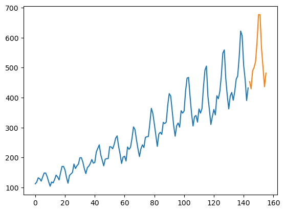

::: {.cell 0=‘e’ 1=‘x’ 2=‘p’ 3=‘o’ 4=‘r’ 5=‘t’}

<details>
<summary>Code</summary>

``` python
import math
import os

import numpy as np
from numba import njit
from statsforecast.ets import nelder_mead
from statsmodels.tsa.seasonal import seasonal_decompose
```

</details>

``` text
/home/ubuntu/statsforecast/statsforecast/core.py:21: TqdmExperimentalWarning: Using `tqdm.autonotebook.tqdm` in notebook mode. Use `tqdm.tqdm` instead to force console mode (e.g. in jupyter console)
  from tqdm.autonotebook import tqdm
```

:::

## cescalc {#cescalc}

::: {.cell 0=‘e’ 1=‘x’ 2=‘p’ 3=‘o’ 4=‘r’ 5=‘t’ 6=‘i’}

<details>
<summary>Code</summary>

``` python
# Global variables 
NONE = 0
SIMPLE = 1
PARTIAL = 2
FULL = 3
TOL = 1.0e-10
HUGEN = 1.0e10
NA = -99999.0
smalno = np.finfo(float).eps
NOGIL = os.environ.get('NUMBA_RELEASE_GIL', 'False').lower() in ['true']
CACHE = os.environ.get('NUMBA_CACHE', 'False').lower() in ['true']
```

</details>

:::

::: {.cell 0=‘h’ 1=‘i’ 2=‘d’ 3=‘e’}

<details>
<summary>Code</summary>

``` python
from fastcore.test import test_eq
from statsforecast.utils import AirPassengers as ap
```

</details>

:::

::: {.cell 0=‘e’ 1=‘x’ 2=‘p’ 3=‘o’ 4=‘r’ 5=‘t’ 6=‘i’}

<details>
<summary>Code</summary>

``` python
def initstate(y, m, seasontype):
    n = len(y)
    components = 2 + (seasontype == 'P') + 2 * (seasontype == 'F')
    lags = 1 if seasontype == 'N' else m
    states = np.zeros((lags, components), dtype=np.float32)
    if seasontype == 'N':
        idx = min(max(10, m), n)
        mean_ = np.mean(y[:idx])
        states[0, 0] = mean_
        states[0, 1] = mean_ / 1.1
    elif seasontype == 'S':
        states[:lags, 0] = y[:lags]
        states[:lags, 1] = y[:lags] / 1.1
    elif seasontype == 'P':
        states[:lags, 0] = np.mean(y[:lags])
        states[:lags, 1] = states[:lags, 0] / 1.1
        states[:lags, 2] = seasonal_decompose(y, period=lags).seasonal[:lags]
    elif seasontype == 'F':
        states[:lags, 0] = np.mean(y[:lags])
        states[:lags, 1] = states[:lags, 0] / 1.1
        states[:lags, 2] = seasonal_decompose(y, period=lags).seasonal[:lags]
        states[:lags, 3] = states[:lags, 2] / 1.1
    else:
        raise Exception(f'Unkwon seasontype: {seasontype}')
        
    return states
```

</details>

:::

::: {.cell 0=‘h’ 1=‘i’ 2=‘d’ 3=‘e’}

<details>
<summary>Code</summary>

``` python
initstate(ap, 12, 'N')
initstate(ap, 12, 'S')
initstate(ap, 12, 'P')
initstate(ap, 12, 'F')
```

</details>

``` text
array([[126.666664 , 115.15151  , -24.748737 , -22.498852 ],
       [126.666664 , 115.15151  , -36.18813  , -32.8983   ],
       [126.666664 , 115.15151  ,  -2.2411616,  -2.0374196],
       [126.666664 , 115.15151  ,  -8.036616 ,  -7.3060145],
       [126.666664 , 115.15151  ,  -4.5063133,  -4.096648 ],
       [126.666664 , 115.15151  ,  35.40278  ,  32.184345 ],
       [126.666664 , 115.15151  ,  63.830807 ,  58.028004 ],
       [126.666664 , 115.15151  ,  62.82323  ,  57.112026 ],
       [126.666664 , 115.15151  ,  16.520203 ,  15.018366 ],
       [126.666664 , 115.15151  , -20.642677 , -18.76607  ],
       [126.666664 , 115.15151  , -53.593433 , -48.721302 ],
       [126.666664 , 115.15151  , -28.61995  , -26.018135 ]],
      dtype=float32)
```

:::

::: {.cell 0=‘e’ 1=‘x’ 2=‘p’ 3=‘o’ 4=‘r’ 5=‘t’ 6=‘i’}

<details>
<summary>Code</summary>

``` python
@njit(nogil=NOGIL, cache=CACHE)
def cescalc(y: np.ndarray,
            states: np.ndarray, # states
            m: int, 
            season: int, 
            alpha_0: float, 
            alpha_1: float,
            beta_0: float, 
            beta_1: float, 
            e: np.ndarray, 
            amse: np.ndarray, 
            nmse: int,
            backfit: int) -> float:
    denom = np.zeros(nmse)
    m = 1 if season == NONE else m
    f = np.zeros(max(nmse, m))
    lik = 0.
    lik2 = 0.
    amse[:nmse] = 0.
    n = len(y)
    for i in range(m, n + m):
        # one step forecast 
        cesfcst(states, i, m, season, f, nmse, alpha_0, alpha_1, beta_0, beta_1)
        if math.fabs(f[0] - NA) < TOL:
            lik = NA
            return lik
        e[i - m] = y[i - m] - f[0]
        for j in range(nmse):
            if (i + j) < n:
                denom[j] += 1.
                tmp = y[i + j] - f[j]
                amse[j] = (amse[j] * (denom[j] - 1.0) + (tmp * tmp)) / denom[j]
        # update state
        cesupdate(states, i, m, season, alpha_0, alpha_1, beta_0, beta_1, y[i - m])
        lik = lik + e[i - m] * e[i - m]
        lik2 += math.log(math.fabs(f[0]))
    new_states = cesfcst(states, n + m, m, season, f, m, alpha_0, alpha_1, beta_0, beta_1)
    states[-m:] = new_states[-m:]
    lik = n * math.log(lik)
    if not backfit:
        return lik
    y[:] = y[::-1]
    states[:] = states[::-1]
    e[:] = e[::-1]
    lik = 0.
    lik2 = 0.
    for i in range(m, n + m):
        # one step forecast 
        cesfcst(states, i, m, season, f, nmse, alpha_0, alpha_1, beta_0, beta_1)
        if math.fabs(f[0] - NA) < TOL:
            lik = NA
            return lik
        e[i - m] = y[i - m] - f[0]
        for j in range(nmse):
            if (i + j) < n:
                denom[j] += 1.
                tmp = y[i + j] - f[j]
                amse[j] = (amse[j] * (denom[j] - 1.0) + (tmp * tmp)) / denom[j]
        # update state
        cesupdate(states, i, m, season, alpha_0, alpha_1, beta_0, beta_1, y[i - m])
        lik = lik + e[i - m] * e[i - m]
        lik2 += math.log(math.fabs(f[0]))
    new_states = cesfcst(states, n + m, m, season, f, m, alpha_0, alpha_1, beta_0, beta_1)
    states[-m:] = new_states[-m:]
    # fit again
    lik = 0.
    lik2 = 0.
    y[:] = y[::-1]
    states[:] = states[::-1]
    e[:] = e[::-1]
    for i in range(m, n + m):
        # one step forecast 
        cesfcst(states, i, m, season, f, nmse, alpha_0, alpha_1, beta_0, beta_1)
        if math.fabs(f[0] - NA) < TOL:
            lik = NA
            return lik
        e[i - m] = y[i - m] - f[0]
        for j in range(nmse):
            if (i + j) < n:
                denom[j] += 1.
                tmp = y[i + j] - f[j]
                amse[j] = (amse[j] * (denom[j] - 1.0) + (tmp * tmp)) / denom[j]
        # update state
        cesupdate(states, i, m, season, alpha_0, alpha_1, beta_0, beta_1, y[i - m])
        lik = lik + e[i - m] * e[i - m]
        lik2 += math.log(math.fabs(f[0]))
    new_states = cesfcst(states, n + m, m, season, f, m, alpha_0, alpha_1, beta_0, beta_1)
    states[-m:] = new_states[-m:]
    lik = n * math.log(lik)
    return lik
```

</details>

:::

::: {.cell 0=‘e’ 1=‘x’ 2=‘p’ 3=‘o’ 4=‘r’ 5=‘t’ 6=‘i’}

<details>
<summary>Code</summary>

``` python
@njit(nogil=NOGIL, cache=CACHE)
def cesfcst(states, i, 
            m, season, 
            f, h, 
            alpha_0, alpha_1, beta_0, beta_1):
    # obs:
    # forecast are obtained in a recursive manner
    # this is not standard, for example in ets
    #forecasts
    new_states = np.zeros((m + h, states.shape[1]), dtype=np.float32)
    new_states[:m] = states[(i - m):i]
    for i_h in range(m, m + h):
        if season in [NONE, PARTIAL, FULL]:
            f[i_h - m] = new_states[i_h - 1, 0]
        else:
            f[i_h - m] = new_states[i_h - m, 0]
        if season > SIMPLE:
            f[i_h - m] += new_states[i_h - m, 2]
        cesupdate(new_states, i_h, m, season, alpha_0, alpha_1, beta_0, beta_1, f[i_h - m])
    return new_states
```

</details>

:::

::: {.cell 0=‘e’ 1=‘x’ 2=‘p’ 3=‘o’ 4=‘r’ 5=‘t’ 6=‘i’}

<details>
<summary>Code</summary>

``` python
@njit(nogil=NOGIL, cache=CACHE)
def cesupdate(states, i,
              m, season, # kind of season 
              alpha_0, alpha_1,
              beta_0, beta_1, y):
    # season
    if season in [NONE, PARTIAL, FULL]:
        e = y - states[i - 1, 0]
    else:
        e = y - states[i - m, 0]
    if season > SIMPLE:
        e -= states[i - m, 2]
        
    if season in [NONE, PARTIAL, FULL]:
        states[i, 0] = states[i - 1, 0] - (1. - alpha_1) * states[i - 1, 1] + (alpha_0 - alpha_1) * e
        states[i, 1] = states[i - 1, 0] + (1. - alpha_0) * states[i - 1, 1] + (alpha_0 + alpha_1) * e
    else:
        states[i, 0] = states[i - m, 0] - (1. - alpha_1) * states[i - m, 1] + (alpha_0 - alpha_1) * e
        states[i, 1] = states[i - m, 0] + (1. - alpha_0) * states[i - m, 1] + (alpha_0 + alpha_1) * e
    
    if season == PARTIAL:
        states[i, 2] = states[i - m, 2] + beta_0 * e
    if season == FULL:
        states[i, 2] = states[i - m, 2] - (1 - beta_1) * states[i - m, 3] + (beta_0 - beta_1) * e
        states[i, 3] = states[i - m, 2] + (1 - beta_0) * states[i - m, 3] + (beta_0 + beta_1) * e
```

</details>

:::

::: {.cell 0=‘e’ 1=‘x’ 2=‘p’ 3=‘o’ 4=‘r’ 5=‘t’ 6=‘i’}

<details>
<summary>Code</summary>

``` python
@njit(nogil=NOGIL, cache=CACHE)
def cesforecast(states, n, m, season, 
                f, h, alpha_0, alpha_1, beta_0, beta_1):
    # compute forecasts
    m = 1 if season == NONE else m
    new_states = cesfcst(
        states=states, i=m + n, m=m, season=season, f=f, h=h, 
        alpha_0=alpha_0, alpha_1=alpha_1, 
        beta_0=beta_0, beta_1=beta_1
    ) 
    return new_states
```

</details>

:::

::: {.cell 0=‘h’ 1=‘i’ 2=‘d’ 3=‘e’}

<details>
<summary>Code</summary>

``` python
#nonseasonal test
nmse_ = len(ap)
amse_ = np.zeros(30)
e_ = np.zeros(len(ap))
alpha_0 = 2.001457
alpha_1 = 1.000727
beta_0 = 0.
beta_1 = 0.
init_states_non_seas = np.zeros((2 + len(ap), 2), dtype=np.float32)
init_states_non_seas[0] = initstate(ap, 12, 'N')
cescalc(y=ap,
        states=init_states_non_seas, m=12, 
        season=NONE, alpha_0=alpha_0, 
        alpha_1=alpha_1, beta_0=beta_0, 
        beta_1=beta_1,
        e=e_, amse=amse_, nmse=3, 
        backfit=1)
np.testing.assert_array_equal(
    init_states_non_seas[[0, -2, -1]],
    np.array([
        [  112.06887, 1301.9882 ],
        [  430.92154 , 2040.1951 ],
        [  432.40475, -1612.2461 ]
    ], dtype=np.float32)
)
```

</details>

:::

::: {.cell 0=‘h’ 1=‘i’ 2=‘d’ 3=‘e’}

<details>
<summary>Code</summary>

``` python
#nonseasonal forecast test
h = 13
fcsts = np.zeros(h, dtype=np.float32)
cesforecast(states=init_states_non_seas, n=len(ap), m=12, 
            season=NONE, 
            f=fcsts, h=h, 
            alpha_0=alpha_0, alpha_1=alpha_1, 
            beta_0=beta_0, beta_1=beta_1)
#taken from R using ces(AirPassengers, h=13)
np.testing.assert_array_almost_equal(
    fcsts,
    np.array([
        430.9211, 432.4049, 431.2324, 432.7212, 431.5439,
        433.0376, 431.8556, 433.3543, 432.1675, 433.6712,
        432.4796, 433.9884, 432.7920
    ], dtype=np.float32), 
    decimal=2
)
```

</details>

:::

::: {.cell 0=‘h’ 1=‘i’ 2=‘d’ 3=‘e’}

<details>
<summary>Code</summary>

``` python
#simple seasonal test
nmse_ = len(ap)
amse_ = np.zeros(30)
lik_ = 0.
e_ = np.zeros(len(ap))
alpha_0 = 1.996411
alpha_1 = 1.206694
beta_0 = 0.
beta_1 = 0.
m = 12
init_states_s_ses = np.zeros((12 * 2 + len(ap), 2), dtype=np.float32)
init_states_s_ses[:m] = initstate(ap, m, 'S')
cescalc(y=ap, 
        states=init_states_s_ses, m=12, 
        season=SIMPLE, alpha_0=alpha_0, 
        alpha_1=alpha_1, beta_0=beta_0, 
        beta_1=beta_1,
        e=e_, amse=amse_, nmse=3, backfit=1)
np.testing.assert_array_equal(
    init_states_s_ses[[0, 11, 145, 143 + 12]],
    np.array([
        [130.49458 ,  36.591137],
        [135.21922 , 121.62022 ],
        [423.57788 , 252.81241 ],
        [505.3621  ,  95.29781 ]
    ], dtype=np.float32)
)
```

</details>

:::

::: {.cell 0=‘h’ 1=‘i’ 2=‘d’ 3=‘e’}

<details>
<summary>Code</summary>

``` python
#simple seasonal forecast test
h = 13
fcsts = np.zeros(h, dtype=np.float32)
cesforecast(states=init_states_s_ses, n=len(ap), m=12, 
            season=SIMPLE, 
            f=fcsts, h=h, 
            alpha_0=alpha_0, alpha_1=alpha_1, 
            beta_0=beta_0, beta_1=beta_1)
#taken from R using ces(AirPassengers, h=13, seasonality = 'simple')
np.testing.assert_array_almost_equal(
    fcsts,
    np.array([
        446.2768, 423.5779, 481.4365, 514.7730, 533.5008,
        589.0500, 688.2703, 674.5891, 580.9486, 516.0776,
        449.7246, 505.3621, 507.9884
    ], dtype=np.float32), 
    decimal=2
)
```

</details>

:::

::: {.cell 0=‘h’ 1=‘i’ 2=‘d’ 3=‘e’}

<details>
<summary>Code</summary>

``` python
#partial seasonal test
nmse_ = len(ap)
amse_ = np.zeros(30)
lik_ = 0.
e_ = np.zeros(len(ap))
alpha_0 = 1.476837
alpha_1 = 1.
beta_0 = 0.91997
beta_1 = 0.
m = 12
init_states_p_seas = np.zeros((12 + len(ap), 3), dtype=np.float32)
init_states_p_seas[:m] = initstate(ap, m, 'P')
cescalc(y=ap, 
        states=init_states_p_seas, m=12, 
        season=2, alpha_0=alpha_0, 
        alpha_1=alpha_1, beta_0=beta_0, 
        beta_1=beta_1,
        e=e_, amse=amse_, nmse=3, backfit=1)
np.testing.assert_array_equal(
    init_states_p_seas[[0, 11, 145, 143 + 12]],
    np.array([
        [122.580666,  83.00358 ,  -9.710966],
        [122.580666,  78.11936 ,  -4.655848],
        [438.5037  , 300.70374 , -25.55726 ],
        [438.5037  , 296.92316 ,  -7.581563]
    ], dtype=np.float32)
)
```

</details>

:::

::: {.cell 0=‘h’ 1=‘i’ 2=‘d’ 3=‘e’}

<details>
<summary>Code</summary>

``` python
#partial seasonal forecast test
h = 13
fcsts = np.zeros(h, dtype=np.float32)
cesforecast(states=init_states_p_seas, n=len(ap), m=12, 
            season=PARTIAL, 
            f=fcsts, h=h, 
            alpha_0=alpha_0, alpha_1=alpha_1, 
            beta_0=beta_0, beta_1=beta_1)
#taken from R using ces(AirPassengers, h=13, seasonality = 'partial')
np.testing.assert_array_almost_equal(
    fcsts,
    np.array([
        437.6247, 412.9464, 445.5811, 498.5370, 493.0405, 550.7443, 
        629.2205, 607.1793, 512.3455, 462.1260, 383.4097, 430.9221, 437.6247
    ], dtype=np.float32), 
    decimal=2
)
```

</details>

:::

::: {.cell 0=‘h’ 1=‘i’ 2=‘d’ 3=‘e’}

<details>
<summary>Code</summary>

``` python
#full seasonal test
nmse_ = len(ap)
amse_ = np.zeros(30)
lik_ = 0.
e_ = np.zeros(len(ap))
alpha_0 = 1.350795
alpha_1 = 1.009169
beta_0 = 1.777909
beta_1 = 0.973739
m = 12
init_states_f_seas = np.zeros((12 * 2 + len(ap), 4), dtype=np.float32)
init_states_f_seas[:m] = initstate(ap, m, 'F')
cescalc(y=ap,
        states=init_states_f_seas, m=12, 
        season=3, alpha_0=alpha_0, 
        alpha_1=alpha_1, beta_0=beta_0, 
        beta_1=beta_1,
        e=e_, amse=amse_, nmse=3, backfit=1)
np.testing.assert_array_equal(
    init_states_f_seas[[0, 11, 145, 143 + 12]],
    np.array([
        [ 227.74284 ,  167.7603  ,  -94.299805,  -39.623283],
        [ 211.48921 ,  155.72342 ,  -91.62251 ,  -82.953064],
        [ 533.1726  ,  372.95758 , -139.31824 , -125.856834],
        [ 564.9041  ,  404.3251  , -130.9048  , -137.33    ]
    ], dtype=np.float32)
)
```

</details>

:::

::: {.cell 0=‘h’ 1=‘i’ 2=‘d’ 3=‘e’}

<details>
<summary>Code</summary>

``` python
#full seasonal forecast test
h = 13
fcsts = np.zeros(h, dtype=np.float32)
cesforecast(states=init_states_f_seas, n=len(ap), m=12, 
            season=FULL, 
            f=fcsts, h=h, 
            alpha_0=alpha_0, alpha_1=alpha_1, 
            beta_0=beta_0, beta_1=beta_1)
#taken from R using ces(AirPassengers, h=13, seasonality = 'full')
np.testing.assert_array_almost_equal(
    fcsts,
    np.array([
        450.9262, 429.2925, 465.4771, 510.1799, 517.9913, 578.5654,
        655.9219, 638.6218, 542.0985, 498.1064, 431.3293, 477.3273,
        501.3757
    ], dtype=np.float32), 
    decimal=2
)
```

</details>

:::

::: {.cell 0=‘e’ 1=‘x’ 2=‘p’ 3=‘o’ 4=‘r’ 5=‘t’ 6=‘i’}

<details>
<summary>Code</summary>

``` python
@njit(nogil=NOGIL, cache=CACHE)
def initparamces(alpha_0: float, alpha_1: float, 
                 beta_0: float, beta_1: float,
                 seasontype: str):
    if np.isnan(alpha_0):
        alpha_0 = 1.3
        optimize_alpha_0 = 1
    else:
        optimize_alpha_0 = 0
    if np.isnan(alpha_1):
        alpha_1 = 1.
        optimize_alpha_1 = 1
    else:
        optimize_alpha_1 = 0
    if seasontype == 'P':
        if np.isnan(beta_0):
            beta_0 = 0.1
            optimize_beta_0 = 1
        else:
            optimize_beta_0 = 0
        beta_1 = np.nan # no optimize
        optimize_beta_1 = 0
    elif seasontype == 'F':
        if np.isnan(beta_0):
            beta_0 = 1.3
            optimize_beta_0 = 1
        else:
            optimize_beta_0 = 0
        if np.isnan(beta_1):
            beta_1 = 1.
            optimize_beta_1 = 1
        else:
            optimize_beta_1 = 0
    else:
        #no optimize
        optimize_beta_0 = 0
        optimize_beta_1 = 0
        beta_0 = np.nan
        beta_1 = np.nan
    return {'alpha_0': alpha_0, 'optimize_alpha_0': optimize_alpha_0,
            'alpha_1': alpha_1, 'optimize_alpha_1': optimize_alpha_1,
            'beta_0': beta_0, 'optimize_beta_0': optimize_beta_0,
            'beta_1': beta_1, 'optimize_beta_1': optimize_beta_1}
```

</details>

:::

::: {.cell 0=‘h’ 1=‘i’ 2=‘d’ 3=‘e’}

<details>
<summary>Code</summary>

``` python
initparamces(alpha_0=np.nan, alpha_1=np.nan, 
             beta_0=np.nan, beta_1=np.nan, 
             seasontype='N')
```

</details>

``` text
DictType[unicode_type,float64]<iv=None>({alpha_0: 1.3, optimize_alpha_0: 1.0, alpha_1: 1.0, optimize_alpha_1: 1.0, beta_0: nan, optimize_beta_0: 0.0, beta_1: nan, optimize_beta_1: 0.0})
```

:::

::: {.cell 0=‘e’ 1=‘x’ 2=‘p’ 3=‘o’ 4=‘r’ 5=‘t’ 6=‘i’}

<details>
<summary>Code</summary>

``` python
@njit(nogil=NOGIL, cache=CACHE)
def switch_ces(x: str):
    return {'N': 0, 'S': 1, 'P': 2, 'F': 3}[x]
```

</details>

:::

::: {.cell 0=‘h’ 1=‘i’ 2=‘d’ 3=‘e’}

<details>
<summary>Code</summary>

``` python
switch_ces('N')
```

</details>

``` text
0
```

:::

::: {.cell 0=‘e’ 1=‘x’ 2=‘p’ 3=‘o’ 4=‘r’ 5=‘t’ 6=‘i’}

<details>
<summary>Code</summary>

``` python
@njit(nogil=NOGIL, cache=CACHE)
def pegelsresid_ces(y: np.ndarray, 
                    m: int, 
                    init_states: np.ndarray, 
                    n_components: int,
                    seasontype: str, 
                    alpha_0: float, alpha_1: float,
                    beta_0: float, beta_1: float, 
                    nmse: int):
    states = np.zeros((len(y) + 2 * m, n_components), dtype=np.float32)
    states[:m] = init_states
    e = np.full_like(y, fill_value=np.nan)
    amse = np.full(nmse, fill_value=np.nan)
    lik = cescalc(y=y, states=states, m=m, 
                  season=switch_ces(seasontype), 
                  alpha_0=alpha_0, alpha_1=alpha_1, 
                  beta_0=beta_0, beta_1=beta_1, e=e, 
                  amse=amse, nmse=nmse, backfit=1)
    if not np.isnan(lik):
        if np.abs(lik + 99999) < 1e-7:
            lik = np.nan
    return amse, e, states, lik
```

</details>

:::

::: {.cell 0=‘e’ 1=‘x’ 2=‘p’ 3=‘o’ 4=‘r’ 5=‘t’}

<details>
<summary>Code</summary>

``` python
@njit(nogil=NOGIL, cache=CACHE)
def ces_target_fn(
        optimal_param,
        init_alpha_0,
        init_alpha_1,
        init_beta_0,
        init_beta_1,
        opt_alpha_0,
        opt_alpha_1,
        opt_beta_0,
        opt_beta_1,
        y,
        m,
        init_states, 
        n_components, 
        seasontype,
        nmse
    ):
    states = np.zeros((len(y) + 2 * m, n_components), dtype=np.float32)
    states[:m] = init_states
    j = 0
    if opt_alpha_0:
        alpha_0 = optimal_param[j]
        j+=1
    else:
        alpha_0 = init_alpha_0
        
    if opt_alpha_1:
        alpha_1 = optimal_param[j]
        j+=1
    else:
        alpha_1 = init_alpha_1
        
    if opt_beta_0:
        beta_0 = optimal_param[j]
        j+=1
    else:
        beta_0 = init_beta_0
        
    if opt_beta_1:
        beta_1 = optimal_param[j]
        j+=1
    else:
        beta_1 = init_beta_1
        
    e = np.full_like(y, fill_value=np.nan)
    amse = np.full(nmse, fill_value=np.nan)
    lik = cescalc(y=y, states=states, m=m, 
                  season=switch_ces(seasontype), 
                  alpha_0=alpha_0, alpha_1=alpha_1, 
                  beta_0=beta_0, beta_1=beta_1, e=e, 
                  amse=amse, nmse=nmse, backfit=1)
    if lik < -1e10: 
        lik = -1e10 
    if math.isnan(lik): 
        lik = -np.inf
    if math.fabs(lik + 99999) < 1e-7: 
        lik = -np.inf
    return lik
```

</details>

:::

::: {.cell 0=‘e’ 1=‘x’ 2=‘p’ 3=‘o’ 4=‘r’ 5=‘t’ 6=‘i’}

<details>
<summary>Code</summary>

``` python
def optimize_ces_target_fn(
        init_par, optimize_params, y, m, init_states,
        n_components, seasontype, nmse
    ):
    x0 = [init_par[key] for key, val in optimize_params.items() if val]
    x0 = np.array(x0, dtype=np.float32)
    if not len(x0):
        return
    
    init_alpha_0 = init_par['alpha_0']
    init_alpha_1 = init_par['alpha_1']
    init_beta_0 = init_par['beta_0']
    init_beta_1 = init_par['beta_1']
    
    opt_alpha_0 = optimize_params['alpha_0']
    opt_alpha_1 = optimize_params['alpha_1']
    opt_beta_0 = optimize_params['beta_0']
    opt_beta_1 = optimize_params['beta_1']
    
    res = nelder_mead(
        ces_target_fn, x0, 
        args=(init_alpha_0, init_alpha_1, init_beta_0, init_beta_1,
              opt_alpha_0, opt_alpha_1, opt_beta_0, opt_beta_1,
              y, m, init_states, n_components, seasontype, nmse),
        tol_std=1e-4, 
        lower=np.array([0.01, 0.01, 0.01, 0.01]),
        upper=np.array([1.8, 1.9, 1.5, 1.5]),
        max_iter=1_000,
        adaptive=True,
    )
    return res
```

</details>

:::

::: {.cell 0=‘e’ 1=‘x’ 2=‘p’ 3=‘o’ 4=‘r’ 5=‘t’ 6=‘i’}

<details>
<summary>Code</summary>

``` python
def cesmodel(y: np.ndarray, m: int, 
             seasontype: str, 
             alpha_0: float, alpha_1: float,
             beta_0: float, beta_1: float, nmse: int):
    if seasontype == 'N':
        m = 1
    #initial parameters
    par = initparamces(alpha_0=alpha_0, alpha_1=alpha_1, beta_1=beta_1, beta_0=beta_0, 
                       seasontype=seasontype)
    optimize_params = {key.replace('optimize_', ''): val for key, val in par.items() if 'optim' in key}
    par = {key: val for key, val in par.items() if 'optim' not in key}
    # initial states
    init_state = initstate(y, m, seasontype)
    n_components = init_state.shape[1]
    # parameter optimization
    fred = optimize_ces_target_fn(
        init_par=par, optimize_params=optimize_params, y=y, m=m, init_states=init_state, 
        n_components=n_components, seasontype=seasontype, nmse=nmse
    )
    if fred is not None:
        fit_par = fred.x
    j = 0
    if optimize_params['alpha_0']:
        par['alpha_0'] = fit_par[j]
        j += 1
    if optimize_params['alpha_1']:
        par['alpha_1'] = fit_par[j]
        j += 1
    if optimize_params['beta_0']:
        par['beta_0'] = fit_par[j]
        j += 1
    if optimize_params['beta_1']:
        par['beta_1'] = fit_par[j]
        j += 1
    
    amse, e, states, lik = pegelsresid_ces(
        y=y, m=m, init_states=init_state, 
        n_components=n_components, seasontype=seasontype,
        nmse=nmse, **par
    )
    np_ = n_components + 1
    ny = len(y)
    aic = lik + 2 * np_
    bic = lik + np.log(ny) * np_
    if ny - np_ - 1 != 0.:
        aicc = aic + 2 * np_ * (np_ + 1) / (ny - np_ - 1)
    else:
        aicc = np.inf
    
    mse = amse[0]
    amse = np.mean(amse)
    
    fitted = y - e
    sigma2 = np.sum(e**2) / (ny - np_ - 1)
    
    return dict(loglik=-0.5 * lik, aic=aic, bic=bic, aicc=aicc,
                mse=mse, amse=amse, fit=fred, fitted=fitted, 
                residuals=e,
                m=m, states=states, par=par, n=len(y), 
                seasontype=seasontype, sigma2=sigma2)
```

</details>

:::

::: {.cell 0=‘h’ 1=‘i’ 2=‘d’ 3=‘e’}

<details>
<summary>Code</summary>

``` python
res = cesmodel(
    y=ap, m=12, seasontype='N',
    alpha_0=np.nan,
    alpha_1=np.nan,
    beta_0=np.nan, 
    beta_1=np.nan,
    nmse=3
)
```

</details>

:::

::: {.cell 0=‘e’ 1=‘x’ 2=‘p’ 3=‘o’ 4=‘r’ 5=‘t’ 6=‘i’}

<details>
<summary>Code</summary>

``` python
def pegelsfcast_C(h, obj, npaths=None, level=None, bootstrap=None):
    forecast = np.full(h, fill_value=np.nan)
    m = obj['m']
    n = obj['n']
    states = obj['states']
    cesforecast(states=states, n=n, m=m, season=switch_ces(obj['seasontype']), 
                h=h, f=forecast, **obj['par'])
    return forecast
```

</details>

:::

::: {.cell 0=‘e’ 1=‘x’ 2=‘p’ 3=‘o’ 4=‘r’ 5=‘t’ 6=‘i’}

<details>
<summary>Code</summary>

``` python
def _simulate_pred_intervals(model, h, level):
    
    np.random.seed(1)
    nsim = 5000
    y_path = np.zeros([nsim, h])

    for k in range(nsim): 
        e = np.random.normal(0, np.sqrt(model['sigma2']), model['states'].shape)
        states = model['states'] 
        fcsts = np.zeros(h, dtype=np.float32)
        cesforecast(states=states+e, n=model['n'], m=model['m'], season=switch_ces(model['seasontype']), 
                    h=h, f=fcsts, **model['par'])
        y_path[k, ] = fcsts

    lower = np.quantile(y_path, 0.5-np.array(level)/200, axis = 0) 
    upper = np.quantile(y_path, 0.5+np.array(level)/200, axis = 0) 
    pi = {**{f'lo-{lv}': lower[i] for i, lv in enumerate(level)}, 
          **{f'hi-{lv}': upper[i] for i, lv in enumerate(level)}} 
    
    return pi 
```

</details>

:::

::: {.cell 0=‘e’ 1=‘x’ 2=‘p’ 3=‘o’ 4=‘r’ 5=‘t’ 6=‘i’}

<details>
<summary>Code</summary>

``` python
def forecast_ces(obj, h, level=None):
    fcst = pegelsfcast_C(h, obj)
    out = {'mean': fcst}
    out['fitted'] = obj['fitted']
    if level is not None: 
        pi = _simulate_pred_intervals(model=obj, h=h, level=level) 
        out = {**out, **pi}
    return out
```

</details>

:::

::: {.cell 0=‘h’ 1=‘i’ 2=‘d’ 3=‘e’}

<details>
<summary>Code</summary>

``` python
forecast_ces(res, 12)
```

</details>

``` text
{'mean': array([425.4909668 , 418.23764038, 417.20217896, 411.30899048,
        409.31863403, 404.30072021, 401.73681641, 397.29034424,
        394.3911438 , 390.32559204, 387.23971558, 383.43545532]),
 'fitted': array([111.56109619, 110.80284882, 115.75682831, 127.64520264,
        127.25749969, 121.23356628, 131.43664551, 143.21429443,
        145.65776062, 136.43022156, 121.37403107, 106.448349  ,
        115.29981995, 113.2879715 , 123.23604584, 135.68395996,
        133.98947144, 125.41249084, 143.90315247, 162.7359314 ,
        167.15493774, 157.95069885, 136.69891357, 117.46504974,
        135.24179077, 140.79986572, 147.62200928, 170.28683472,
        162.30929565, 169.4316864 , 174.01069641, 193.22810364,
        194.96430969, 185.0322876 , 164.38105774, 148.92181396,
        161.40661621, 167.23983765, 176.22636414, 187.79754639,
        180.36148071, 181.31173706, 209.19767761, 223.26193237,
        236.59030151, 211.21881104, 194.43563843, 173.8631897 ,
        189.98594666, 191.44697571, 194.59770203, 225.55633545,
        230.54612732, 227.41044617, 237.99581909, 256.5743103 ,
        266.28869629, 239.87271118, 215.35282898, 184.70532227,
        197.56135559, 199.47155762, 189.32220459, 224.53625488,
        223.11038208, 231.02746582, 254.63824463, 290.73843384,
        288.41299438, 262.97305298, 233.07894897, 207.56184387,
        223.43325806, 235.58903503, 231.45147705, 258.41104126,
        263.38269043, 267.09191895, 303.01217651, 348.88757324,
        342.86477661, 315.74026489, 279.09725952, 243.6000824 ,
        269.98516846, 277.31842041, 275.37564087, 306.24783325,
        307.94717407, 313.97589111, 359.30108643, 398.31872559,
        399.43780518, 359.93969727, 314.07681274, 277.02716064,
        299.06750488, 307.60397339, 300.26794434, 342.65856934,
        342.17095947, 350.77175903, 404.32092285, 448.67779541,
        458.54653931, 410.06893921, 356.84228516, 312.1730957 ,
        330.09188843, 333.31512451, 318.95864868, 350.89852905,
        344.02932739, 357.60412598, 415.91226196, 471.86126709,
        493.12350464, 415.95144653, 369.09017944, 317.03948975,
        333.10385132, 349.24465942, 341.42248535, 390.36172485,
        389.59515381, 412.17611694, 455.16033936, 526.29248047,
        545.22076416, 474.4119873 , 417.28396606, 369.2520752 ,
        396.52514648, 407.22021484, 391.50579834, 410.10629272,
        447.18649292, 462.13031006, 517.5447998 , 595.34234619,
        597.00506592, 519.95367432, 469.76443481, 400.61547852])}
```

:::

::: {.cell 0=‘e’ 1=‘x’ 2=‘p’ 3=‘o’ 4=‘r’ 5=‘t’ 6=‘i’}

<details>
<summary>Code</summary>

``` python
def auto_ces(y, m, model='Z', 
             alpha_0=None, alpha_1=None, 
             beta_0=None, beta_1=None,
             opt_crit='lik', nmse=3, 
             ic='aicc'):
    # converting params to floats 
    # to improve numba compilation
    if alpha_0 is None:
        alpha_0 = np.nan
    if alpha_1 is None:
        alpha_1 = np.nan
    if beta_0 is None:
        beta_0 = np.nan
    if beta_1 is None:
        beta_1 = np.nan
    if nmse < 1 or nmse > 30:
        raise ValueError('nmse out of range')
    #refit model not implement yet
    if model not in ['Z', 'N', 'S', 'P', 'F']:
        raise ValueError('Invalid model type')

    seasontype = model
    if m < 1 or len(y) <= m or m == 1:
        seasontype = 'N'
    n = len(y)
    npars = 2 
    if seasontype == 'P':
        npars += 1 
    if seasontype  in ['F', 'Z']:
        npars += 2 
    #ses for non-optimized tiny datasets
    if n <= npars:
        #we need HoltWintersZZ function
        raise NotImplementedError('tiny datasets')
    if seasontype == 'Z':
        seasontype = ['N', 'S', 'P', 'F']
    best_ic = np.inf
    for stype in seasontype:
        fit = cesmodel(y=y, m=m, seasontype=stype,
                       alpha_0=alpha_0, alpha_1=alpha_1,
                       beta_0=beta_0, beta_1=beta_1, nmse=nmse)
        fit_ic = fit[ic]
        if not np.isnan(fit_ic):
            if fit_ic < best_ic:
                model = fit
                best_ic = fit_ic
    if np.isinf(best_ic):
        raise Exception('no model able to be fitted')
    return model
```

</details>

:::

::: {.cell 0=‘h’ 1=‘i’ 2=‘d’ 3=‘e’}

<details>
<summary>Code</summary>

``` python
import matplotlib.pyplot as plt
res = auto_ces(ap, m=12, model='F')
fcst = forecast_ces(res, 12)
plt.plot(np.arange(0, len(ap)), ap)
plt.plot(np.arange(len(ap), len(ap) + 12), fcst['mean'])
```

</details>



:::

::: {.cell 0=‘e’ 1=‘x’ 2=‘p’ 3=‘o’ 4=‘r’ 5=‘t’ 6=‘i’}

<details>
<summary>Code</summary>

``` python
def forward_ces(fitted_model, y):
    m = fitted_model['m']
    model = fitted_model['seasontype']
    alpha_0 = fitted_model['par']['alpha_0']
    alpha_1 = fitted_model['par']['alpha_1']
    beta_0 = fitted_model['par']['beta_0']
    beta_1 = fitted_model['par']['beta_1']
    return auto_ces(y=y, m=m, model=model, 
                    alpha_0=alpha_0, alpha_1=alpha_1,
                    beta_0=beta_0, beta_1=beta_1)
```

</details>

:::

::: {.cell 0=‘h’ 1=‘i’ 2=‘d’ 3=‘e’}

<details>
<summary>Code</summary>

``` python
res = auto_ces(ap, m=12)
test_eq(
    forecast_ces(forward_ces(res, ap), h=12)['mean'],
    forecast_ces(res, h=12)['mean']
)
# test tranfer
forecast_ces(forward_ces(res, np.log(ap)), h=12)
res_transfer = forward_ces(res, np.log(ap))
for key in res_transfer['par']:
    test_eq(res['par'][key], res_transfer['par'][key])
```

</details>

:::

